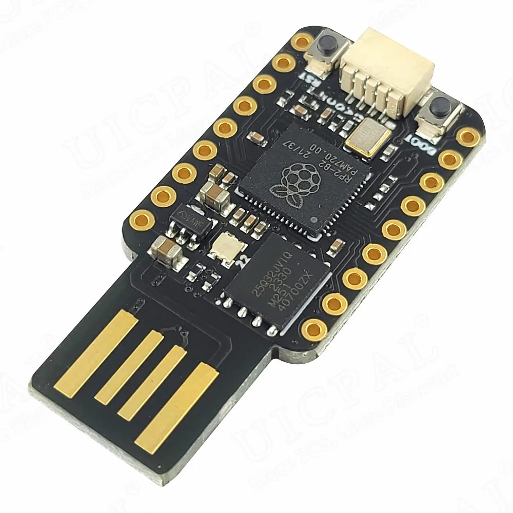
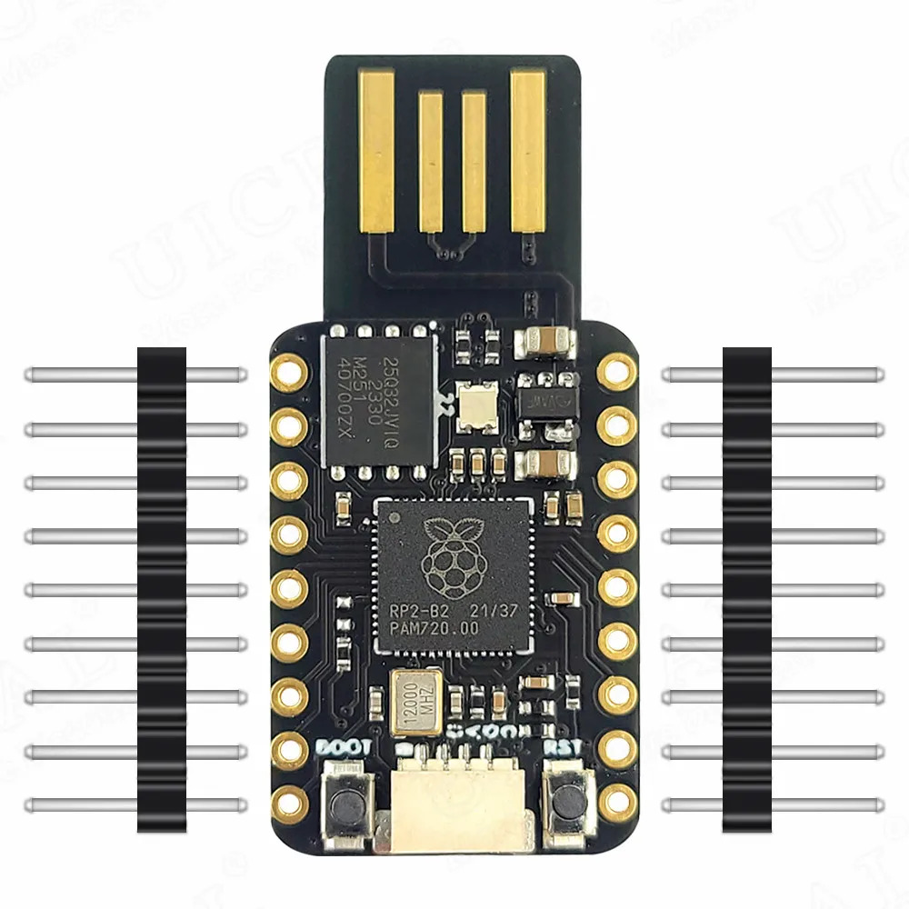
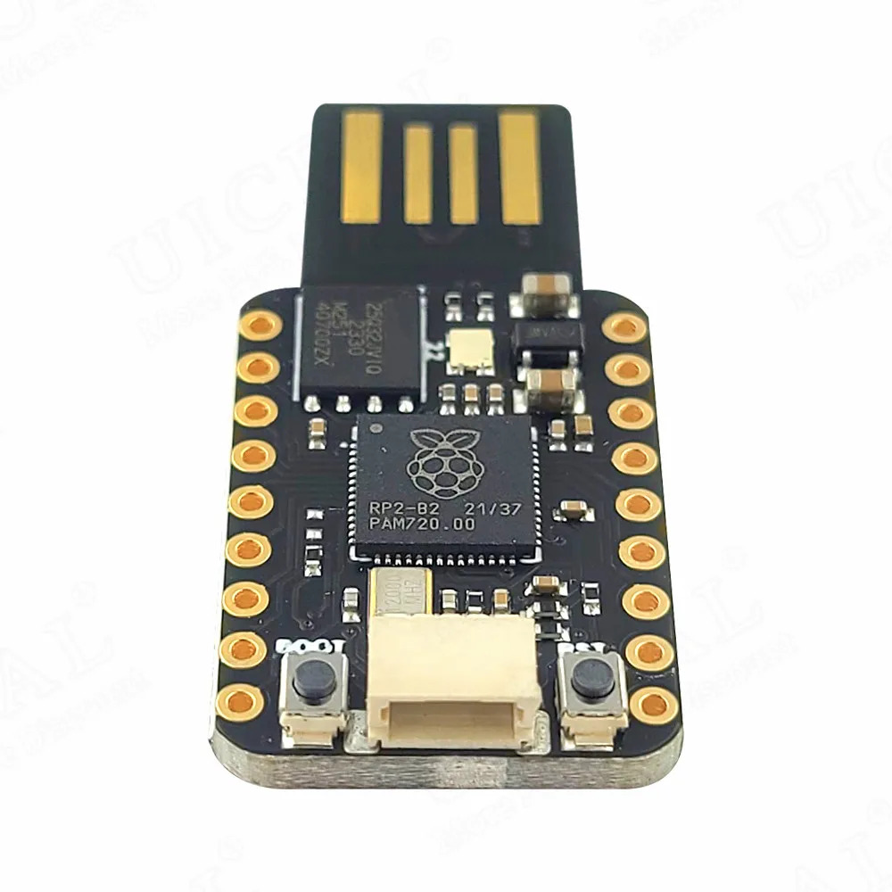
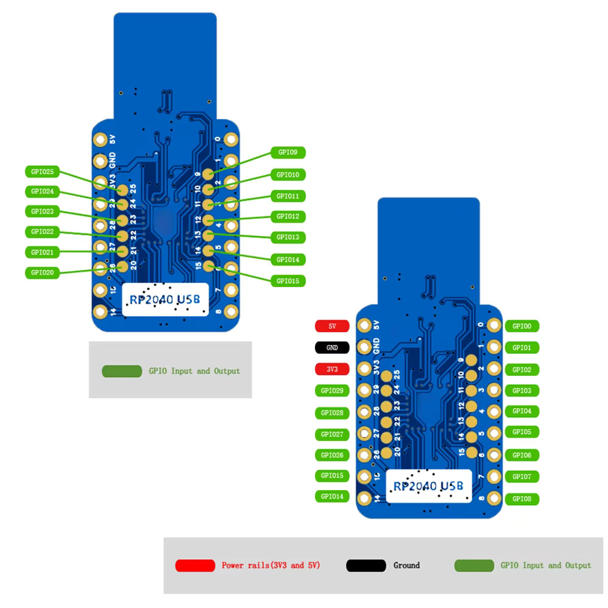
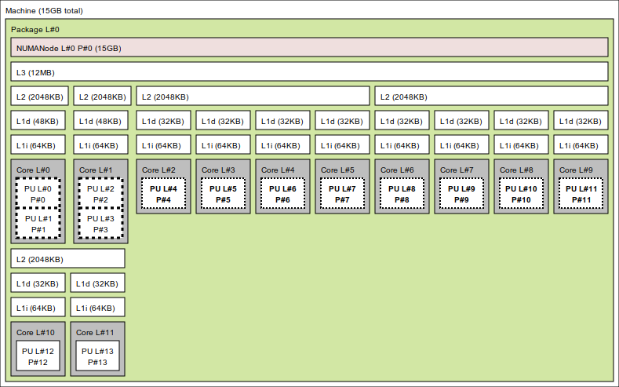
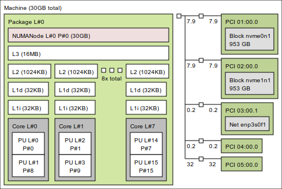
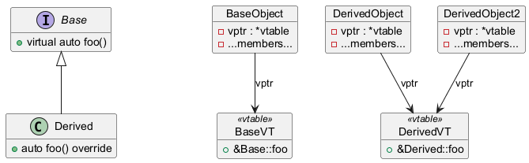
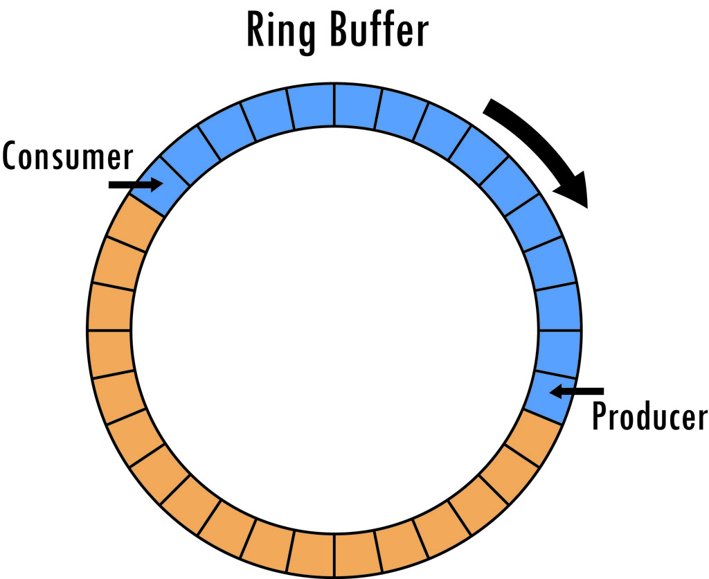

#+title: Personal Website Content
#+author: David Álvarez Rosa
#+startup: logdone
#+filetags: :pers:blog:
#+CATEGORY: Blog

* TODO [#B] Perf improvements website
- CDN
- RTT optimization -> HTML at edge
- Multiple image sizes
- Font split for dropcap
- etc.

* TODO [#B] QUIC protocol

* TODO [#B] Building a Mouse Jiggler
:PROPERTIES:
:EXPORT_FILE_NAME: todo-fake-keyboard-mouse
:END:

A microcontroller that pretends to be a keyboard and mouse is one of the
most useful weekend projects I've put together.  It can keep a machine
awake during a long compile, replay a tedious sequence of shortcuts at
the press of a button, or type out whatever you want---all from a board
that costs a couple of euros.

I built mine on an RP2040[fn:: *The board.*
Roughly the size of a thumbnail---the USB-A plug is etched into the PCB
instead of soldered on.]---Raspberry Pi's first in-house silicon, whose
native USB controller makes HID emulation possible without any extra
hardware.  Source and prebuilt firmware are on [[https://github.com/david-alvarez-rosa/FakeKeyboardMouse][GitHub]].

[[/images/mouse-demo.gif]]

A single press of the ~BOOTSEL~ button starts the automation; another
press stops it.

** Hardware

Any RP2040 board works.  I picked up a cheap MINI USB RP2040 Development
Board Module from AliExpress---dual core, 4 MB flash, around three euros
shipped.

#+caption: *The order.*  €3.86 a board with free shipping---I grabbed seven so a brick or two along the way wouldn't end the project.

The official Raspberry Pi Pico is the better documented option, but
these no-name clones are pin-compatible and the same firmware runs on
either.

** Flashing the firmware

While holding the ~BOOTSEL~ button, plug the board into your computer.
It enumerates as a USB mass storage device.  Identify it with ~lsblk~,
create a mount point, and mount it.

#+begin_src sh
  $ lsblk
  $ sudo mkdir /mnt/micro
  $ sudo mount /dev/sda1 /mnt/micro
#+end_src

Grab the latest ~.uf2~ from the [[https://github.com/david-alvarez-rosa/FakeKeyboardMouse/releases][releases]] page.  Three binaries are
published: ~fake_keyboard~ for keyboard only, ~fake_mouse~ for mouse
only, and ~fake_keyboard_mouse~ for both.  Copy whichever one you want.

#+begin_src sh
  $ cp fake_keyboard.uf2 /mnt/micro
#+end_src

The board reboots automatically and re-enumerates as a keyboard, a
mouse, or both.  Press ~BOOTSEL~ to start the automation, press it again
to stop.

** Building from source

If you'd rather build it yourself, install the ARM toolchain.[fn::
~arm-none-eabi-gcc~ is the cross-compiler targeting ARM
microcontrollers; ~arm-none-eabi-newlib~ provides a slim C standard
library suited for embedded targets.]

#+begin_src sh
  $ sudo pacman -S arm-none-eabi-gcc arm-none-eabi-newlib  # Arch
  $ sudo apt-get install gcc-arm-none-eabi libnewlib-arm-none-eabi  # Debian
#+end_src

Fetch the Pico SDK and ~picotool~ submodules.[fn::The Pico SDK ships the
C/C++ libraries for RP2040 development; ~picotool~ is a command-line
utility for inspecting boards and uploading firmware.]

#+begin_src sh
  $ git submodule update --init --recursive
#+end_src

Build with CMake, pointing ~PICO_SDK_PATH~ at the SDK submodule.

#+begin_src sh
  $ PICO_SDK_PATH=./lib/pico-sdk cmake -B build -G Ninja
  $ cmake --build build
#+end_src

The build emits three ~.uf2~ files under ~build~, matching the binaries
on the releases page.  Flash one as described above.

#+begin_src sh
  $ cp ./build/fake_keyboard.uf2 /mnt/micro
#+end_src

** Hello, world

The fastest way to confirm the board, toolchain, and SDK are all wired
up correctly is to flash a minimal program and watch it print over USB
serial.

#+begin_src cpp
  #include <stdio.h>

  #include "pico/stdlib.h"

  auto main() -> int {
    stdio_init_all();
    while (true) {
      printf("Hello, world!\n");
      sleep_ms(1000);
    }
  }
#+end_src

A matching ~CMakeLists.txt~

#+begin_src cmake
  cmake_minimum_required(VERSION 3.13)

  include(./lib/pico-sdk/pico_sdk_init.cmake)
  project(HelloWorld C CXX ASM)

  set(CMAKE_EXPORT_COMPILE_COMMANDS ON)

  pico_sdk_init()

  add_executable(hello_world main.cpp)
  pico_enable_stdio_usb(hello_world 1)
  pico_enable_stdio_uart(hello_world 0)
  target_link_libraries(hello_world pico_stdlib)
  pico_add_extra_outputs(hello_world)
#+end_src

Build and flash the same way as before.

#+begin_src sh
  $ PICO_SDK_PATH=./lib/pico-sdk cmake -B build -G Ninja
  $ cmake --build build
  $ cp ./build/hello_world.uf2 /mnt/micro
#+end_src

Once it reboots, attach to the serial TTY[fn::The board exposes USB CDC
as ~/dev/ttyACM0~ on Linux.  Exit ~screen~ with ~Ctrl-a k~.] and watch
the greeting roll in.

#+begin_src sh
  $ screen /dev/ttyACM0
  Hello, world!
  Hello, world!
  Hello, world!
#+end_src

If that works, you have everything you need to iterate on your own HID
firmware.

** Specifications

The only specs the manufacturer shipped with the board are these
photos---no datasheet, no pinout diagram, nothing.[fn::Welcome to
no-name AliExpress electronics.  The RP2040 itself is well documented,
so in practice the official datasheet is what you'll lean on.]

|  |  |  |
|  |  |  |

\\

That's all the moving parts.  The repository ships a few example
scripts to get you started---swap them out, recompile, and the board
will type[fn::[[/images/keyboard-demo.gif]] *The keyboard variant in
action.*] or wiggle in whatever pattern you like.

* TODO [#B] Minimalist Invoice

* TODO [#B] Laissez Faire, Laissez Mourir
:PROPERTIES:
:EXPORT_FILE_NAME: laissez-faire-laissez-mourir
:END:

There is an arrangement in which whoever cannot pay to survive is
told, "Die, then."  We live in it.  It has been on my mind as the
world prepares to mint its first trillionaire.  What follows is
numbers.  They are worse than you think.  Elon Musk is worth $834
billion---a fifth of what the bottom half of America, 66 million
households, owns combined[fn::Federal Reserve, [[https://www.federalreserve.gov/releases/z1/dataviz/dfa/distribute/table/][Distributional Financial Accounts]]:
the bottom 50% of US households held $4.1 trillion---2.5% of
household net worth---at end-2024.]---and his approved pay package
runs to one trillion.  This is what a trillion looks like.

#+begin_export html
<figure class="trillion fullwidth">
  

    <svg width="94090" height="432" viewBox="0 0 94090 432" role="img"
         aria-label="A horizontal halftone field of one million specks,
         each speck one million dollars, together one trillion dollars.
         The field scrolls to the right for ninety-four thousand
         pixels before it ends.">
      <defs>
        <pattern id="speck" width="6" height="6" patternUnits="userSpaceOnUse">
          <circle cx="3" cy="3" r="2" fill="#111"/>
        </pattern>
      </defs>
      <text class="halo" x="2" y="16">&#9660; each speck: one million dollars&#8201;&#8212;&#8201;one comfortable retirement</text>
      <text class="halo" x="2" y="36">(the median family&#8217;s everything, $192,900: a fifth of a speck)</text>
      <rect x="0" y="48" width="93750" height="384" fill="url(#speck)"/>
      <text class="halo" x="937.5" y="86" text-anchor="middle">$10 billion</text>
      <text class="halo" x="1875" y="86" text-anchor="middle">$20 billion</text>
      <text class="halo" x="2812.5" y="86" text-anchor="middle">$30 billion</text>
      <text class="halo" x="3750" y="86" text-anchor="middle">$40 billion</text>
      <text class="halo" x="4687.5" y="86" text-anchor="middle">$50 billion</text>
      <text class="halo" x="5625" y="86" text-anchor="middle">$60 billion</text>
      <text class="halo" x="6562.5" y="86" text-anchor="middle">$70 billion</text>
      <text class="halo" x="7500" y="86" text-anchor="middle">$80 billion</text>
      <text class="halo" x="8437.5" y="86" text-anchor="middle">$90 billion</text>
      <text class="halo big" x="9375" y="86" text-anchor="middle">one hundred billion</text>
      <text class="halo" x="10312.5" y="86" text-anchor="middle">$110 billion</text>
      <text class="halo" x="11250" y="86" text-anchor="middle">$120 billion</text>
      <text class="halo" x="12187.5" y="86" text-anchor="middle">$130 billion</text>
      <text class="halo" x="13125" y="86" text-anchor="middle">$140 billion</text>
      <text class="halo" x="14062.5" y="86" text-anchor="middle">$150 billion</text>
      <text class="halo" x="15000" y="86" text-anchor="middle">$160 billion</text>
      <text class="halo" x="15937.5" y="86" text-anchor="middle">$170 billion</text>
      <text class="halo" x="16875" y="86" text-anchor="middle">$180 billion</text>
      <text class="halo" x="17812.5" y="86" text-anchor="middle">$190 billion</text>
      <text class="halo big" x="18750" y="86" text-anchor="middle">two hundred billion</text>
      <text class="halo" x="19687.5" y="86" text-anchor="middle">$210 billion</text>
      <text class="halo" x="20625" y="86" text-anchor="middle">$220 billion</text>
      <text class="halo" x="21562.5" y="86" text-anchor="middle">$230 billion</text>
      <text class="halo" x="22500" y="86" text-anchor="middle">$240 billion</text>
      <text class="halo" x="23437.5" y="86" text-anchor="middle">$250 billion</text>
      <text class="halo" x="24375" y="86" text-anchor="middle">$260 billion</text>
      <text class="halo" x="25312.5" y="86" text-anchor="middle">$270 billion</text>
      <text class="halo" x="26250" y="86" text-anchor="middle">$280 billion</text>
      <text class="halo" x="27187.5" y="86" text-anchor="middle">$290 billion</text>
      <text class="halo big" x="28125" y="86" text-anchor="middle">three hundred billion</text>
      <text class="halo" x="29062.5" y="86" text-anchor="middle">$310 billion</text>
      <text class="halo" x="30000" y="86" text-anchor="middle">$320 billion</text>
      <text class="halo" x="30937.5" y="86" text-anchor="middle">$330 billion</text>
      <text class="halo" x="31875" y="86" text-anchor="middle">$340 billion</text>
      <text class="halo" x="32812.5" y="86" text-anchor="middle">$350 billion</text>
      <text class="halo" x="33750" y="86" text-anchor="middle">$360 billion</text>
      <text class="halo" x="34687.5" y="86" text-anchor="middle">$370 billion</text>
      <text class="halo" x="35625" y="86" text-anchor="middle">$380 billion</text>
      <text class="halo" x="36562.5" y="86" text-anchor="middle">$390 billion</text>
      <text class="halo big" x="37500" y="86" text-anchor="middle">four hundred billion</text>
      <text class="halo" x="38437.5" y="86" text-anchor="middle">$410 billion</text>
      <text class="halo" x="39375" y="86" text-anchor="middle">$420 billion</text>
      <text class="halo" x="40312.5" y="86" text-anchor="middle">$430 billion</text>
      <text class="halo" x="41250" y="86" text-anchor="middle">$440 billion</text>
      <text class="halo" x="42187.5" y="86" text-anchor="middle">$450 billion</text>
      <text class="halo" x="43125" y="86" text-anchor="middle">$460 billion</text>
      <text class="halo" x="44062.5" y="86" text-anchor="middle">$470 billion</text>
      <text class="halo" x="45000" y="86" text-anchor="middle">$480 billion</text>
      <text class="halo" x="45937.5" y="86" text-anchor="middle">$490 billion</text>
      <text class="halo big" x="46875" y="86" text-anchor="middle">five hundred billion</text>
      <text class="halo" x="47812.5" y="86" text-anchor="middle">$510 billion</text>
      <text class="halo" x="48750" y="86" text-anchor="middle">$520 billion</text>
      <text class="halo" x="49687.5" y="86" text-anchor="middle">$530 billion</text>
      <text class="halo" x="50625" y="86" text-anchor="middle">$540 billion</text>
      <text class="halo" x="51562.5" y="86" text-anchor="middle">$550 billion</text>
      <text class="halo" x="52500" y="86" text-anchor="middle">$560 billion</text>
      <text class="halo" x="53437.5" y="86" text-anchor="middle">$570 billion</text>
      <text class="halo" x="54375" y="86" text-anchor="middle">$580 billion</text>
      <text class="halo" x="55312.5" y="86" text-anchor="middle">$590 billion</text>
      <text class="halo big" x="56250" y="86" text-anchor="middle">six hundred billion</text>
      <text class="halo" x="57187.5" y="86" text-anchor="middle">$610 billion</text>
      <text class="halo" x="58125" y="86" text-anchor="middle">$620 billion</text>
      <text class="halo" x="59062.5" y="86" text-anchor="middle">$630 billion</text>
      <text class="halo" x="60000" y="86" text-anchor="middle">$640 billion</text>
      <text class="halo" x="60937.5" y="86" text-anchor="middle">$650 billion</text>
      <text class="halo" x="61875" y="86" text-anchor="middle">$660 billion</text>
      <text class="halo" x="62812.5" y="86" text-anchor="middle">$670 billion</text>
      <text class="halo" x="63750" y="86" text-anchor="middle">$680 billion</text>
      <text class="halo" x="64687.5" y="86" text-anchor="middle">$690 billion</text>
      <text class="halo big" x="65625" y="86" text-anchor="middle">seven hundred billion</text>
      <text class="halo" x="66562.5" y="86" text-anchor="middle">$710 billion</text>
      <text class="halo" x="67500" y="86" text-anchor="middle">$720 billion</text>
      <text class="halo" x="68437.5" y="86" text-anchor="middle">$730 billion</text>
      <text class="halo" x="69375" y="86" text-anchor="middle">$740 billion</text>
      <text class="halo" x="70312.5" y="86" text-anchor="middle">$750 billion</text>
      <text class="halo" x="71250" y="86" text-anchor="middle">$760 billion</text>
      <text class="halo" x="72187.5" y="86" text-anchor="middle">$770 billion</text>
      <text class="halo" x="73125" y="86" text-anchor="middle">$780 billion</text>
      <text class="halo" x="74062.5" y="86" text-anchor="middle">$790 billion</text>
      <text class="halo big" x="75000" y="86" text-anchor="middle">eight hundred billion</text>
      <text class="halo" x="75937.5" y="86" text-anchor="middle">$810 billion</text>
      <text class="halo" x="76875" y="86" text-anchor="middle">$820 billion</text>
      <text class="halo" x="77812.5" y="86" text-anchor="middle">$830 billion</text>
      <text class="halo" x="78750" y="86" text-anchor="middle">$840 billion</text>
      <text class="halo" x="79687.5" y="86" text-anchor="middle">$850 billion</text>
      <text class="halo" x="80625" y="86" text-anchor="middle">$860 billion</text>
      <text class="halo" x="81562.5" y="86" text-anchor="middle">$870 billion</text>
      <text class="halo" x="82500" y="86" text-anchor="middle">$880 billion</text>
      <text class="halo" x="83437.5" y="86" text-anchor="middle">$890 billion</text>
      <text class="halo big" x="84375" y="86" text-anchor="middle">nine hundred billion</text>
      <text class="halo" x="85312.5" y="86" text-anchor="middle">$910 billion</text>
      <text class="halo" x="86250" y="86" text-anchor="middle">$920 billion</text>
      <text class="halo" x="87187.5" y="86" text-anchor="middle">$930 billion</text>
      <text class="halo" x="88125" y="86" text-anchor="middle">$940 billion</text>
      <text class="halo" x="89062.5" y="86" text-anchor="middle">$950 billion</text>
      <text class="halo" x="90000" y="86" text-anchor="middle">$960 billion</text>
      <text class="halo" x="90937.5" y="86" text-anchor="middle">$970 billion</text>
      <text class="halo" x="91875" y="86" text-anchor="middle">$980 billion</text>
      <text class="halo" x="92812.5" y="86" text-anchor="middle">$990 billion</text>
      <text class="halo" x="300" y="416">&#9758; scroll</text>
      <line x1="93750.5" y1="48" x2="93750.5" y2="432" stroke="#111" stroke-width="1"/>
      <text class="mk-lbl" x="93764" y="246">one trillion dollars</text>
    </svg>
  

  <figcaption>
<strong>One trillion dollars.</strong>  One
  million specks, one million dollars each&#8212;64 specks tall, 15,625
  specks wide.  A speck is a comfortable retirement; the median family
  owns a fifth of one.  The plate runs ninety-four thousand pixels to
  the right&#8212;some twenty-five metres of paper&#8212;and it does end.
  Counted at one dollar per second: a million dollars takes 11&#189;
  days; a billion, 32 years; the full plate, 31,700 years.
</figcaption>
</figure>

#+end_export

Capital compounds; labour does not.  At a conservative 5%, $834
billion yields a median household income ($83,730)[fn::U.S. Census Bureau,
[[https://www.census.gov/library/publications/2025/demo/p60-286.html][/Income in the United States: 2024/]], report P60-286, September
2025.] every 63 seconds---a forty-year working life every 42 minutes.
Once returns exceed any possible spending, a fortune is no longer
earned; it accrues.

The taxes bind mostly those who work.  The 25 richest Americans added
$401 billion to their net worth over 2014--2018 and paid $13.6
billion in income tax---a true rate of 3.4%: Musk 3.27% (zero in
2018), Bezos 0.98%, Buffett 0.10%.[fn::ProPublica,
[[https://www.propublica.org/article/the-secret-irs-files-trove-of-never-before-seen-records-reveal-how-the-wealthiest-avoid-income-tax][/The Secret IRS Files/]], June 8, 2021.  The "true tax rate" compares
federal income tax paid with growth in net worth over the same
period.]  A wage earner pays 15.3% from the first dollar---7.65%
withheld, 7.65% more via the employer, borne by the worker---four and
a half times the billionaires' rate, before income tax even begins.

Jeff Yass, owner of Susquehanna ($65 billion),[fn::[[https://www.forbes.com/profile/jeffrey-yass/][Forbes profile]],
December 2025.] paid the 20% long-term rate on trading income
ordinarily taxed near 40%---roughly $1 billion saved, disputed in
court.[fn::ProPublica,
[[https://www.propublica.org/article/how-susquehanna-yass-avoided-billion-taxes][/How Susquehanna's Jeff Yass Avoided $1 Billion in Taxes/]], 2022.
The Tax Court dispute was filed in 2020 and remains pending.]
Susquehanna also owns some 15% of ByteDance, TikTok's
parent;[fn::[[https://www.inquirer.com/politics/pennsylvania/tiktok-ban-jeff-yass-congress-house-20240313.html]["A ban on TikTok would be a blow to local billionaire investor and GOP megadonor Jeff Yass,"]]
/The Philadelphia Inquirer/, March 13, 2024;
[[https://abcnews.go.com/Politics/trumps-tiktok-ban-reversal-after-meeting-megadonor-stake/story?id=108013785][ABC News]], March 2024.] Yass put $100 million into the 2024 election
cycle---$16 million linked to anti-Muslim and pro-Israel
groups[fn::[[https://www.opensecrets.org/outside-spending/donor_detail/2024?id=U0000004245&name=Yass%2C+Jeffrey+S][OpenSecrets, donor detail, 2024 cycle]]; E. Clifton,
[[https://www.theguardian.com/us-news/2024/apr/24/jeff-yass-anti-muslim-pro-israel-donations]["Billionaire Jeff Yass linked to $16m in donations to anti-Muslim and pro-Israel groups,"]]
/The Guardian/, April 24, 2024.]---and days after they met in March
2024, Trump reversed his support for the TikTok ban; the
divest-or-ban law, passed anyway, went unenforced.  $100 million
shielding a $21 billion stake: 210 to 1.

None of this breaks the law, because the law taxes realization, not
accrual: never sell; borrow against the shares---loan proceeds are
not income; die, and the cost basis resets, erasing the gain for the
heirs.  Buy, borrow, die.  Not a loophole but the design: taxing
those gains at death would raise $536 billion over a decade in the US
alone.[fn::Congressional Budget Office, Budget Option:
[[https://www.cbo.gov/budget-options/60943][/Change the Tax Treatment of Capital Gains from Sales of Inherited Assets/]],
December 2024.]  Tens of millions then pass untaxed to heirs whose
classmates' median family owns $192,900---total.[fn::Federal Reserve Board,
[[https://www.federalreserve.gov/publications/october-2023-changes-in-us-family-finances-from-2019-to-2022.htm][/Changes in U.S. Family Finances from 2019 to 2022/]], Survey of
Consumer Finances, October 2023.]  That is not equality of
opportunity.

Neither is it democracy.  Globally, 1.6% of adults own 48.1% of all
wealth ($226 trillion); the poorest 1.55 billion share under 1%; the
2,891 billionaires alone hold $15.6 trillion---and wealth buys the
legislature's attention.[fn::UBS, [[https://www.ubs.com/global/en/wealthmanagement/insights/global-wealth-report.html][/Global Wealth Report 2025/]],
June 2025; figures as of end-2024.]  Laissez faire for them; laissez
mourir for the rest.

Tax the rich.  Tax net worth.  Tax inheritance.  Suckers!

* TODO [#B] Deriving and understanding Black-Scholes                :backlog:

* TODO [#B] Starting a new C++ project                              :backlog:

* TODO [#B] Self-Hosting an Email Server
:PROPERTIES:
:EXPORT_FILE_NAME: selfhost-email-server
:END:

Self-hosting email gives you full control over your communications---no
ads, no scanning, no one can lock you out.  It's easier than most people
think, and this guide covers everything I do when setting up a new mail
server.

You'll need a server with a clean Linux install[fn::I use Debian for
servers.  For initial server setup, see my [[/posts/first-steps-on-a-new-server/][First Steps on a New Server]]
post.] and a domain name pointing to your server's IP.

** DNS records

Create DNS records for your mail server: A and AAAA records for
~mail.alvarezrosa.com~, plus an MX record pointing to it.[fn::MX records
tell other mail servers where to deliver mail.  The number 10 is the
priority---lower numbers are tried first if you have multiple mail
servers.]  Verify propagation

#+begin_src sh
  $ dig mail.alvarezrosa.com A +short
  213.32.19.229
  $ dig mail.alvarezrosa.com AAAA +short
  2001:41d0:305:2100::febc
  $ dig alvarezrosa.com MX +short
  10 mail.alvarezrosa.com.
#+end_src

Update your server's hostname to match the mail FQDN.  Edit ~/etc/hosts~
so that ~hostname -f~ returns the fully qualified domain name[fn::Postfix
uses the FQDN to identify itself in SMTP conversations.  The short
hostname can remain ~homelab~, but ~hostname -f~ must return
~mail.alvarezrosa.com~.]

#+begin_src text
  127.0.1.1  mail.alvarezrosa.com  homelab
#+end_src

** Receiving mail

Install Postfix and open port 25.  During installation, select "Internet
Site" and enter ~mail.alvarezrosa.com~ as the system mail name.

#+begin_src sh
  $ sudo apt install postfix
  $ sudo ufw allow 25/tcp
#+end_src

Configure Postfix to accept mail for your domain.  Edit
~/etc/postfix/main.cf~ and add your domain to ~mydestination~

#+begin_src conf
  mydestination = $myhostname, mail.alvarezrosa.com, localhost.alvarezrosa.com, localhost, alvarezrosa.com
#+end_src

Restart Postfix and verify it's listening[fn::You can also test the
connection with ~telnet mail.alvarezrosa.com 25~---you should see a
Postfix greeting.]

#+begin_src sh
  $ sudo systemctl restart postfix
  $ sudo ss -tlnp | grep :25
  LISTEN 0  100  0.0.0.0:25  0.0.0.0:*  users:(("master",pid=13124,fd=13))
  LISTEN 0  100     [::]:25     [::]:*  users:(("master",pid=13124,fd=14))
#+end_src

Send a test email to ~david@alvarezrosa.com~ from Gmail, then check it
arrived

#+begin_src sh
  $ sudo apt install mailutils
  $ mail
  "/var/mail/david": 1 message 1 new
  >N   1 David Álvarez Ros Wed Feb  4 19:39  80/4544  Hello from GMail
#+end_src

Your server can now receive mail from anywhere in the world.

** Sending mail

Configure Postfix to use your domain in outgoing messages.  Edit
~/etc/postfix/main.cf~

#+begin_src conf
  myhostname = mail.alvarezrosa.com
  mydomain = alvarezrosa.com
  myorigin = $mydomain
#+end_src

Restart and send a test message

#+begin_src sh
  $ sudo systemctl restart postfix
  $ echo "Test from my mail server" | mail -s "Hello" recipient@example.com
#+end_src

TODO check this without DMARC policy -- If you send to a major provider
like Gmail before setting up authentication, your message will likely
land in spam or be silently dropped.  That's expected---we'll fix it in
the authentication section.

** Client access

At this point you can send and receive mail, but only from the server's
command line.  To use a real email client, you need IMAP for reading and
authenticated SMTP for sending.

Install Dovecot to expose mailboxes via IMAP.[fn::IMAP keeps messages on
the server and syncs across devices.  I prefer it over POP3, which
downloads messages and typically deletes them from the server.]

#+begin_src sh
  $ sudo apt install dovecot-core dovecot-imapd
#+end_src

Obtain a TLS certificate for the mail subdomain[fn::Certbot obtains free
certificates from Let's Encrypt and auto-renews them.  Email clients
require TLS for secure connections.]

#+begin_src sh
  $ sudo certbot certonly -d mail.alvarezrosa.com
#+end_src

Configure Dovecot TLS.  Edit ~/etc/dovecot/conf.d/10-ssl.conf~

#+begin_src conf
  ssl = required
  ssl_server_cert_file = /etc/letsencrypt/live/mail.alvarezrosa.com/fullchain.pem
  ssl_server_key_file = /etc/letsencrypt/live/mail.alvarezrosa.com/privkey.pem
#+end_src

Configure Postfix TLS.  Add to ~/etc/postfix/main.cf~

#+begin_src conf
  smtpd_tls_key_file = /etc/letsencrypt/live/mail.alvarezrosa.com/privkey.pem
  smtpd_tls_cert_file = /etc/letsencrypt/live/mail.alvarezrosa.com/fullchain.pem
  smtpd_tls_security_level = encrypt
#+end_src

Enable authenticated SMTP submission.  Edit ~/etc/postfix/master.cf~ and
uncomment the submissions section

#+begin_src conf
  submissions inet n       -       y       -       -       smtpd
    -o syslog_name=postfix/submissions
    -o smtpd_tls_wrappermode=yes
    -o smtpd_sasl_auth_enable=yes
    -o smtpd_recipient_restrictions=permit_sasl_authenticated,reject
    -o milter_macro_daemon_name=ORIGINATING
#+end_src

Configure Postfix to use Dovecot for SASL authentication.  Add to
~/etc/postfix/main.cf~

#+begin_src conf
  smtpd_sasl_type = dovecot
  smtpd_sasl_path = private/auth
  smtpd_sasl_auth_enable = yes
#+end_src

Connect Dovecot authentication to Postfix.  This lets Postfix
authenticate users against Dovecot.  Edit
~/etc/dovecot/conf.d/10-master.conf~ and configure the auth service

#+begin_src conf
  service auth {
    unix_listener /var/spool/postfix/private/auth {
      mode = 0660
    }
  }
#+end_src

Open ports 465 (SMTPS) and 993 (IMAPS)

#+begin_src sh
  $ sudo ufw allow 465/tcp
  $ sudo ufw allow 993/tcp
#+end_src

Restart services

#+begin_src sh
  $ sudo systemctl restart dovecot postfix
#+end_src

Configure your email client: IMAP server ~mail.alvarezrosa.com~ port
993, SMTP server ~mail.alvarezrosa.com~ port 465, both with SSL/TLS.
Use your Linux username and password as credentials.[fn::I use mu4e in
Emacs.  For testing, Thunderbird works well and auto-detects most
settings.]  Verify you can send and receive.

You now have a fully functional email server---you can read and compose
mail from any client.  The hard part is done.

** Authentication

Your server works, but mail will land in spam without proper
authentication.  Modern email requires four mechanisms: rDNS, SPF, DKIM,
and DMARC.  Each one builds trust with receiving servers, proving you
are who you claim to be and that your messages haven't been forged or
tampered with.

*rDNS.*  Reverse DNS (also called PTR records) maps your IP back to your
domain, proving you control it.  Most mail servers reject messages from
IPs without proper rDNS.  Configure it through your VPS provider's
control panel---map your IPs to ~mail.alvarezrosa.com~ and verify

#+begin_src sh
  $ dig +short -x 213.32.19.229
  mail.alvarezrosa.com.
#+end_src

*SPF.*  SPF (Sender Policy Framework) specifies which servers can send
mail for your domain, preventing spammers from forging your address.
Create a DNS TXT record on your root domain: ~v=spf1 mx -all~ means only
servers listed in your MX records can send; reject all others.[fn::Use
~~all~ (soft fail) instead of ~-all~ (hard fail) during testing.]
Verify the record

#+begin_src sh
  $ dig +short TXT alvarezrosa.com
  "v=spf1 mx -all"
#+end_src

*DKIM.*  DKIM (DomainKeys Identified Mail) adds a cryptographic
signature to outgoing mail.  Receivers verify it against a public key in
your DNS, proving the message came from your server and wasn't altered
in transit.  Install OpenDKIM to sign outgoing messages.

#+begin_src sh
  $ sudo apt install opendkim opendkim-tools
  $ sudo mkdir -p /etc/opendkim/keys/alvarezrosa.com
  $ sudo opendkim-genkey -D /etc/opendkim/keys/alvarezrosa.com -d alvarezrosa.com -s mail
  $ sudo chown -R opendkim:opendkim /etc/opendkim/keys
  $ sudo chmod 600 /etc/opendkim/keys/alvarezrosa.com/mail.private
#+end_src

The generated file contains your public key.  Create a DNS TXT record at
~mail._domainkey.alvarezrosa.com~ with its contents

#+begin_src sh
  $ sudo cat /etc/opendkim/keys/alvarezrosa.com/mail.txt
#+end_src

Verify the record is published

#+begin_src sh
  $ dig +short TXT mail._domainkey.alvarezrosa.com
  "v=DKIM1; h=sha256; k=rsa; p=MIIBIjANBgkqhkiG9w0B..."
#+end_src

Configure OpenDKIM.  Edit ~/etc/opendkim.conf~[fn::Mode ~sv~ tells
OpenDKIM to sign outgoing mail and verify incoming signatures.]

#+begin_src conf
  Mode            sv
  Domain          alvarezrosa.com
  Selector        mail
  KeyFile         /etc/opendkim/keys/alvarezrosa.com/mail.private
  Socket          inet:12301@localhost
  UserID          opendkim
  PidFile         /run/opendkim/opendkim.pid
#+end_src

Hook Postfix to OpenDKIM.  Add to ~/etc/postfix/main.cf~

#+begin_src conf
  milter_default_action = accept
  milter_protocol = 6
  smtpd_milters = inet:localhost:12301
  non_smtpd_milters = inet:localhost:12301
#+end_src

Restart services

#+begin_src sh
  $ sudo systemctl enable --now opendkim
  $ sudo systemctl restart postfix
#+end_src

*DMARC.*  DMARC ties SPF and DKIM together, telling receivers what to do
when checks fail.  Create a DNS TXT record at ~_dmarc.alvarezrosa.com~.
The ~p~ parameter sets the policy: start with ~p=none~ to monitor
without affecting delivery, then switch to ~p=reject~ once everything
works.  The ~rua~ parameter sends aggregate reports to your email.

#+begin_example
  v=DMARC1; p=reject; rua=mailto:david@alvarezrosa.com
#+end_example

Verify the record

#+begin_src sh
  $ dig +short TXT _dmarc.alvarezrosa.com
  "v=DMARC1; p=reject; rua=mailto:david@alvarezrosa.com"
#+end_src

** Verification

Send a test email to Gmail and check the message headers---SPF, DKIM,
and DMARC should all show ~pass~.  Use [[https://www.mail-tester.com][mail-tester.com]] for a
comprehensive deliverability check (aim for 10/10) and [[https://mxtoolbox.com/SuperTool.aspx][MX Toolbox]] to
verify your DNS records.

Congratulations---your email server is now fully operational, with
proper authentication that major providers will trust.  Messages should
land in inboxes, not spam folders.

Note that new mail servers often face deliverability issues due to IP
reputation.  If your mail lands in spam initially, keep sending
legitimate emails and request delisting from any blacklists your IP
appears on.  Building a positive reputation can take weeks.

* TODO [#B] Template Argument Deduction                             :backlog:

- https://en.cppreference.com/w/cpp/language/template_argument_deduction.html
- Perfect forwarding

* TODO [#B] Value Categories                                        :backlog:

- https://en.cppreference.com/w/cpp/language/value_category.html
- https://0xghost.dev/blog/std-move-deep-dive/

* TODO [#B] Self-Hosting Behind CGNAT
:PROPERTIES:
:EXPORT_FILE_NAME: self-hosting-behind-cgnat
:END:

This site is self-hosted on a server that cannot accept a single
inbound connection: the ISP puts it behind CGNAT, so there is no public
IP to forward ports on.  The fix is a /bridge/---a bastion with a
real public address---and a WireGuard tunnel dialed out from the
homelab: clients connect to the bridge, and the bridge forwards
everything back through the tunnel.

** The plan

With carrier-grade NAT, the ISP shares one public IPv4 address across
many customers: your router's WAN address is itself
private[fn::Usually in ~100.64.0.0/10~, the shared address space
reserved for CGNAT by RFC 6598.]---a second NAT, outside your home,
that you don't control.  The classic recipe of port forwarding plus
dynamic DNS[fn::Shaky even without CGNAT: a rotating address is bad
for anything reputation-sensitive like mail, and every rotation means
downtime while resolvers keep serving the old IP until the TTL
expires.] dies here: forwarding only gets you through the first NAT,
and the address DDNS would publish is shared with hundreds of
strangers.  Inbound connections are simply impossible.

But outbound connections still work fine---so the homelab dials /out/,
opening a WireGuard tunnel to the bridge and keeping it alive.  The
bridge keeps only WireGuard itself and its own SSH, and forwards every
other inbound connection through the tunnel.  From the outside, the
bridge /is/ the homelab---DNS just points at it.[fn::The bridge only
pushes packets, so the smallest of servers will do.  See [[/posts/first-steps-on-a-new-server/][First Steps on
a New Server]] for the basic setup.]  Inside the tunnel, the bridge is ~10.0.0.1~ and the
homelab ~10.0.0.2~.

#+begin_example
     client                                 admin
        |                                     |
        |                                     |
  +---------------------------------------------------------+
  |                     public Internet                     |
  +---------------------------------------------------------+
        |                         |               |
        |                         |               |
  +---------------------+    +--------------+     |
  | bridge    10.0.0.1  |    |  Cloudflare  |     |  homelab's own
  | DNAT  * ->  homelab |    +--------------+     |  outbound traffic
  +---------------------+         ^^              |
        ^^                        ||              |
        ||  WireGuard             || cloudflared  |
        ||  (all ports)           || (backup SSH) |
        vv                        vv              |
  +---------------------------------------------------------+
  |           homelab   10.0.0.2   (behind CGNAT)           |
  +---------------------------------------------------------+
        |                                     ^
        |   self-check via bridge---or reboot |
        +-------------------------------------+
#+end_example

Both tunnels are dialed out from the homelab---only outbound works
behind CGNAT.  The admin SSHes in through the bridge like any other
client (port 22 is forwarded with the rest); the homelab's own
outbound traffic never crosses it, only replies to forwarded
connections do.  The Cloudflare backup tunnel and the watchdog loop
are covered at the end.

** The tunnel

On both machines, install WireGuard and generate a keypair; exchange
the public keys---the private ones never leave their machine.

The bridge's entire setup lives in ~/etc/wireguard/wg0.conf~

#+begin_src conf
  [Interface]
  Address = 10.0.0.1/24
  PrivateKey = <bridge-private-key>
  ListenPort = 51820
  PostUp = ...
  PostDown = ...

  [Peer]
  PublicKey = <homelab-public-key>
  AllowedIPs = 10.0.0.2/32
#+end_src

where ~PostUp~ enables IP forwarding and installs the five iptables
rules that do the forwarding, tying their lifetime to the
tunnel's[fn::~PostDown~ mirrors ~PostUp~, undoing every command.
~ens3~ is the bridge's public interface---find yours with ~ip a~ and
adjust.]

#+begin_src sh
  sysctl -w net.ipv4.ip_forward=1 net.ipv4.conf.ens3.route_localnet=1
  iptables -t nat -A PREROUTING -i ens3 -p udp --dport 51820 -j RETURN
  iptables -t nat -A PREROUTING -i ens3 -p tcp --dport 2222 -j RETURN
  iptables -t nat -A PREROUTING -i ens3 -j DNAT --to-destination 10.0.0.2
  iptables -A FORWARD -i wg0 -o ens3 -s 10.0.0.2 -j ACCEPT
  iptables -A FORWARD -i ens3 -o wg0 -d 10.0.0.2 -j ACCEPT
#+end_src

Two ~RETURN~ rules keep WireGuard (~51820/udp~) and the bridge's own
SSH (~2222/tcp~) local; the catch-all ~DNAT~ rewrites everything
else---port 22 included---to the homelab's tunnel address; and two
~FORWARD~ accepts let that traffic flow both ways.[fn::Note there is no
~MASQUERADE~: conntrack reverses the DNAT on the way out, and the
homelab routes its replies back through the tunnel.  Forwarded services
see the /real/ client IP---something proxies and third-party tunnels
can't offer.]  Everything happens inside the kernel: netfilter does
the rewriting, and no userspace process ever touches a packet.

The bridge's own sshd listens on 2222 precisely so that port 22 can be
forwarded with everything else: ~ssh alvarezrosa.com~ lands on the
homelab, ~ssh -p 2222~ on the bridge.[fn::Add ~Port 2222~ to the
bridge's ~/etc/ssh/sshd_config~ /before/ bringing the tunnel up---the
moment the DNAT rule takes effect, port 22 belongs to the homelab.]

The homelab side dials out and answers.  Its ~/etc/wireguard/wg0.conf~

#+begin_src conf
  [Interface]
  Address = 10.0.0.2/24
  PrivateKey = <homelab-private-key>
  Table = off
  PostUp = ...
  PostDown = ...

  [Peer]
  PublicKey = <bridge-public-key>
  Endpoint = 213.32.19.229:51820
  AllowedIPs = 0.0.0.0/0
  PersistentKeepalive = 25
#+end_src

where ~PostUp~ sets up policy routing.

#+begin_src sh
  ip route add default dev wg0 table 200
  ip rule add from 10.0.0.2 table 200
#+end_src

Each line earns its place: ~AllowedIPs = 0.0.0.0/0~ accepts forwarded
clients from anywhere on the Internet; ~Table = off~ stops ~wg-quick~
from hijacking /all/ of the homelab's traffic through the
bridge[fn::Without it, ~wg-quick~ would install a default route
matching ~AllowedIPs~.]; the policy routing sends only replies of
forwarded connections---packets /from/ ~10.0.0.2~---back through the
tunnel; and ~PersistentKeepalive~ keeps the CGNAT's idle UDP mapping
alive, so the bridge can always reach in.

Enable the tunnel on both machines with
~sudo systemctl enable --now wg-quick@wg0~ and verify the handshake
with ~sudo wg~.  Then the real test: from outside, any connection to
the bridge's public IP should land on the homelab.  Point your DNS
records at the bridge and the homelab is, for all practical purposes,
on the public Internet.

The detour adds latency: this bridge sits in France, the homelab in
northern Spain, and the tunnel adds ~37 ms of RTT to every
connection.[fn::Amusingly, pinging the bridge's /public/ IP from the
homelab reports ~74 ms---exactly double.  The echo request is DNAT'd
back through the tunnel to the homelab itself, so every packet crosses
the tunnel twice.]  Not a problem in practice: with heavy optimization
and a CDN absorbing most requests, this site---served through this
very tunnel---is among the fastest on the web.

** Plan for failure

Two single points of failure, and a plan for each.

If the /bridge/ dies, the tunnel dies with it---so keep a way into the
homelab that bypasses it entirely.  I run a [[https://developers.cloudflare.com/cloudflare-one/][Cloudflare Tunnel]]:
~cloudflared~ uses the same dial-out trick, outbound-only on both ends,
so it also works behind CGNAT.[fn::Tailscale fills the same role.]  It
exposes the homelab's sshd at a hostname of its own, and a
~ProxyCommand~ in the client's ~\~/.ssh/config~ connects through
it---whatever happens to the bridge, ~ssh homelab2~ still gets in.

If the /homelab/ dies, no tunnel will save you---the machine to reboot
is the one you can't reach.  So it watches itself with a root cron
job---~0 5 * * * ssh ssh.alvarezrosa.com || reboot~---that SSHes to
its own public hostname, out through CGNAT to the bridge and back in
through the tunnel, the whole chain end to end, and reboots if that
fails.[fn::A bridge outage also trips this check and reboots a
perfectly healthy homelab---an acceptable false positive, since a
reboot is harmless.]

\\

That's the whole trick: one cheap bridge, one tunnel, five iptables
rules---and a server behind CGNAT serves the public Internet, this very
page included.

* TODO [#B] Incremental clang-tidy tool                             :backlog:
:PROPERTIES:
:EXPORT_FILE_NAME: pending-incremental
:END:

How to incrementally run clang-tidy or cppcheck

* TODO [#B] SFINAE                                                  :backlog:

Pending.

* TODO [#B] Lru Cache                                               :backlog:

Pending.

* TODO [#B] Small buffer optimization                               :backlog:

Specially small string optimization.

* TODO [#B] Optimizing Matrix Multiplication                        :backlog:

Fastest matrix multiplication.

- https://www.youtube.com/watch?v=GHctcSBd6Z4
-

* TODO [#B] Translation Look Aside Buffer                           :backlog:
:PROPERTIES:
:EXPORT_FILE_NAME: translation-look-aside-buffer
:END:

Explain what the TLB is, using maybe hrt blog?

* TODO [#B] Vector push_back                                        :backlog:

In-depth vector push_back following guide

* TODO [#B] Implementing a Shared_ptr                               :backlog:

Implement a shared_ptr

* TODO [#B] Exploring CPU Caches                                    :backlog:
:PROPERTIES:
:EXPORT_FILE_NAME: exploring-cpu-caches
:END:

Pending.

* TODO [#B] Optimizing a Spin-Lock
:PROPERTIES:
:EXPORT_FILE_NAME: optimizing-a-spin-lock
:END:
:LOGBOOK:
CLOCK: [2026-06-06 Sat 11:48]--[2026-06-06 Sat 12:05] =>  0:17
:END:

A spin-lock is a mutex that never sleeps: instead of yielding to the
scheduler when the lock is taken, the thread stays on the CPU and keeps
retrying---/spinning/---until it succeeds, avoiding syscalls and context
switches for critical sections of a few nanoseconds.  In this post we'll
write the basic version, see why it is slow, and fix it step by step
until it beats ~std::mutex~ by 3.4x under contention.

** The benchmark

Each thread increments a shared counter under the lock---250k
increments in total, split evenly across threads.  The total work is
/fixed:/ with a perfect lock the time stays flat as threads are added,
and any growth is pure synchronization overhead.  Threads are pinned to
their own cores[fn::With ~pthread_setaffinity_np~, on a machine tuned
for benchmarking (AMD Ryzen 7 PRO 8700GE, 8 cores at 3.65 GHz):
performance governor, hyperthreading and turbo boost disabled.]

#+begin_src cpp
  template <typename SpinLock>
  auto BM_SpinLock(benchmark::State& state) -> void {
    const auto num_threads = state.range(0);

    auto spin_lock = SpinLock{};
    auto val = std::uint64_t{};
    auto threads = std::vector<std::thread>{};
    threads.reserve(num_threads);

    for (auto _ : state) {
      for (auto i = 0U; i < num_threads; ++i) {
        threads.emplace_back([&, i] {
          pinThread(i);
          for (auto j = 0U; j < 250'000U / num_threads; ++j) {
            spin_lock.lock();
            ++val;
            spin_lock.unlock();
          }
        });
      }
      for (auto& thread : threads) thread.join();
      benchmark::DoNotOptimize(val);
      threads.clear();
    }
  }
#+end_src

Every version below exposes ~lock~ and ~unlock~.  The baseline,
~SpinLockV0~, simply wraps ~std::mutex~

#+begin_src sh
  BM_SpinLock<SpinLockV0>/1/real_time       1.62 ms
  BM_SpinLock<SpinLockV0>/2/real_time       5.48 ms
  BM_SpinLock<SpinLockV0>/4/real_time       6.13 ms
#+end_src

Going from one thread to two more than triples the time, but from two
to four it barely moves: a contended ~std::mutex~ parks waiters in the
kernel and wakes them one at a time, so the damage does not compound.
The number to beat: *6.13 ms* at four threads.

** A basic spin-lock

The simplest correct spin-lock is an atomic bool and an exchange
loop[fn::~exchange~ atomically writes ~true~ and returns the previous
value: ~false~ means the lock was free and is now ours; ~true~ means
someone else holds it, and we retry.]

#+begin_src cpp
  class SpinLockV1 {
    std::atomic_bool locked_{false};

  public:
    auto lock() noexcept -> void { while (locked_.exchange(true)); }
    auto unlock() noexcept -> void { locked_.store(false); }
  };
#+end_src

#+begin_src sh
  BM_SpinLock<SpinLockV1>/1/real_time       1.20 ms
  BM_SpinLock<SpinLockV1>/2/real_time       10.3 ms
  BM_SpinLock<SpinLockV1>/4/real_time       14.5 ms
#+end_src

Uncontended, the spin-lock already wins: *1.20 ms* against the mutex's
1.62 ms---locking is now a single atomic instruction with no library
machinery around it.  Under contention it is a disaster: 1.9x slower
than the mutex at two threads, 2.4x at four---while burning CPU for the
entire wait.

The problem is cache coherence.  To write to a cache line, a core must
first own it exclusively, invalidating every other core's copy.  An
atomic exchange is a write /even when it fails/ and merely swaps ~true~
over ~true~.  So every waiting thread constantly steals the line away
from everyone else---including from the lock holder, who needs that same
line back just to /release/ the lock.  The line ping-pongs between
cores, and the one useful increment drowns in coherence traffic.

~perf stat -d~ counts hardware events; compare one thread against four

#+begin_src sh
  $ perf stat -d ./benchmark --benchmark_filter='V1>/1' --benchmark_min_time=500x
      128,088,290      branches
        1,896,594      branch-misses            #   1.48% of all branches
      645,478,415      L1-dcache-loads
        1,687,482      L1-dcache-load-misses    #   0.26% of all accesses

  $ perf stat -d ./benchmark --benchmark_filter='V1>/4' --benchmark_min_time=500x
      674,575,244      branches
      105,479,892      branch-misses            #  15.64% of all branches
    3,262,419,243      L1-dcache-loads
      293,873,584      L1-dcache-load-misses    #   9.05% of all accesses
#+end_src

A 35x jump in cache miss rate on the same nine bytes of data, and one
branch in six mispredicted: whether the exchange succeeds is decided by
the other cores, and the predictor cannot learn it.  ~perf
c2c~---perf's tool for cache-line contention---ranks cache lines by how
often a core found them dirty in /another/ core's cache (a /HITM/ event)

#+begin_src sh
  $ perf c2c record -a -- ./benchmark --benchmark_filter='V1>/4'
  $ perf c2c report --stdio
  =================================================
             Shared Data Cache Line Table
  =================================================
  Index             Address      Hitm
      0      0x7fffffffb440    91.49%
      1  0xffff8c025e923700     2.13%
#+end_src

A single cache line---the one holding the lock and the
counter---accounts for 91% of all HITM events.  Spinning is not free in
watts either; the CPU's own energy meter[fn::The RAPL counters, which
perf exposes as ~power/energy-pkg/~; reading them requires system-wide
mode (~-a~) and root.] puts a number on the wait

#+begin_src sh
  $ perf stat -a -e power/energy-pkg/ ./benchmark --benchmark_filter='V1>/4' --benchmark_min_time=200x
            24.43 Joules power/energy-pkg/
#+end_src

The mutex does the same 200 iterations for *14.9 J*.

** Active backoff

The fix is to stop writing while waiting: attempt the exchange once and,
if it fails, spin on a plain load---read-only copies of the line can
live in every core's L1, so waiting generates no traffic at all.  But
when the holder releases, every waiter sees the lock free at the same
instant, and the whole herd stampedes for the exchange---one wins, the
rest pay the coherence storm anyway.  To thin the herd, space out the
reads with a small delay loop[fn::~volatile~ keeps the compiler from
deleting the empty loop.  The 150 iterations are a tunable parameter,
experimentally determined.]

#+begin_src cpp
  class SpinLockV2 {
    std::atomic_bool locked_{false};

  public:
    auto lock() noexcept -> void {
      while (true) {
        if (!locked_.exchange(true)) return;
        do {
          for (volatile int i = 0; i < 150; ++i);
        } while (locked_.load());
      }
    }
    auto unlock() noexcept -> void { locked_.store(false); }
  };
#+end_src

At two threads the time drops to *4.82 ms*---2.1x faster than the basic
version and already ahead of the mutex.  At four threads, *12.0 ms*,
most of the gain evaporates: the herd is bigger, and a fixed delay no
longer keeps threads apart.  The counters expose a hidden cost, too:
the cache misses barely improve (*8.6%* against 9.1%), and the energy
gets worse, *29.5 J* against 24.4 J---the delay loop is busy-work
executed at full speed.

** Passive backoff

The delay loop burns the whole wait executing useless increments.  x86
has an instruction for exactly this: ~pause~, exposed as the
~_mm_pause()~ intrinsic[fn::From ~<immintrin.h>~; ARM's closest
equivalent is the ~yield~ instruction.], which inserts a short delay
with the pipeline relaxed

#+begin_src cpp
  class SpinLockV3 {
    std::atomic_bool locked_{false};

  public:
    auto lock() noexcept -> void {
      while (true) {
        if (!locked_.exchange(true)) return;
        do {
          for (auto i = 0; i < 4; ++i) _mm_pause();
        } while (locked_.load());
      }
    }
    auto unlock() noexcept -> void { locked_.store(false); }
  };
#+end_src

The four ~pause~ calls roughly match the delay of the 150-iteration
loop, and the timings land in the same place: *5.02 ms* at two threads
and *10.9 ms* at four.  The difference is in what the timings don't
show: ~perf~ counts *24x fewer instructions* for the same work---the
core now spends the wait deliberately doing nothing---and the energy
drops from active backoff's 29.5 J to *17.9 J*.

** Exponential backoff

Pausing made the wait cheap, but the timings barely moved---and with a
/constant/ delay they cannot: all waiters poll at the same rate, so
every release still wakes the whole herd, and the collisions remain.
For the waiters to arrive at different times, their delays must differ:
let each thread double its delay every time it finds the lock still
taken, up to a cap[fn::Without the cap, threads would end up pausing
long after the lock has become free.  Both bounds, 4 and 1024, are
tunable.]

#+begin_src cpp
  class SpinLockV4 {
    std::atomic_bool locked_{false};

  public:
    auto lock() noexcept -> void {
      auto backoff_iters = 4;
      while (true) {
        if (!locked_.exchange(true)) return;
        do {
          for (auto i = 0; i < backoff_iters; ++i) _mm_pause();
          backoff_iters = std::min(backoff_iters << 1, 1024);
        } while (locked_.load());
      }
    }
    auto unlock() noexcept -> void { locked_.store(false); }
  };
#+end_src

The timings collapse: *1.62 ms* at two threads and *1.80 ms* at
four---within 1.5x of the single-threaded time, approaching the flat
line of a perfect lock.  That is 3.4x faster than ~std::mutex~ and 8x
faster than the basic spin-lock.

The counters explain the win: at four threads the cache miss rate falls
to *1.6%*, branch mispredictions to *2.9%*, and the energy to *3.8 J*, a
quarter of the mutex's 14.9 J---all near their single-threaded levels.
That is the signature of threads running one at a time: backoff
approximately /serializes/ them.  Waiters sit in pause loops of up to
1024 iterations, so the releasing thread usually re-acquires the lock
immediately---lock and counter still warm in its L1---and races through
its share of increments while everyone else stays out of the way.
Serialization is optimal here, since the increments cannot run in
parallel anyway.[fn::It is also maximally /unfair:/ nothing stops one
thread from re-acquiring the lock indefinitely while another starves in
its backoff loop.  Real implementations bound the unfairness, or enforce
FIFO order outright with a ticket lock---at a cost in throughput.]

** Summary

If you want to reproduce these results, the [[https://github.com/david-alvarez-rosa/CppPlayground/blob/main/dsa/spin_lock.cpp][benchmark]] lives in my
[[https://github.com/david-alvarez-rosa/CppPlayground][CppPlayground]] repository.  Each cell reads time / L1d cache misses,
with the winners in bold.

| Version | 1 thread          | 2 threads           | 4 threads           |
|---------+-------------------+---------------------+---------------------|
|       0 | 1.62 ms / *0.03%* | 5.48 ms / 1.03%     | 6.13 ms / 1.60%     |
|       1 | *1.20 ms* / 0.26% | 10.3 ms / 3.78%     | 14.5 ms / 9.05%     |
|       2 | 1.25 ms / 0.25%   | 4.82 ms / 3.08%     | 12.0 ms / 8.61%     |
|       3 | 1.25 ms / 0.27%   | 5.02 ms / 2.60%     | 10.9 ms / 6.14%     |
|       4 | 1.25 ms / 0.28%   | *1.62 ms* / *0.67%* | *1.80 ms* / *1.59%* |

The journey is the interesting part: the basic spin-lock lost to
~std::mutex~ by 2.4x, and three small fixes---each derived from a
measurement---turned that into a 3.4x win.  In real code,
~std::mutex~ remains the right default; reach for a spin-lock when the
critical section is tiny, the threads have dedicated cores, and you have
measured the difference.

* TODO [#B] Tuning a Server for Benchmarking
:PROPERTIES:
:EXPORT_FILE_NAME: tuning-a-server-for-benchmarking
:END:

Optimizing code starts with measuring it, and a measurement is only
useful if it is repeatable: a 2% improvement is invisible under 5% of
noise.  Yet on an untuned machine the same binary can easily run several
percent faster or slower between runs, as clocks ramp up and down, the
scheduler migrates threads, and background noise leaks into the
measurement.  In this post we take a tiny benchmark and tune the machine
step by step---re-measuring after every change---until runs become
deterministic.[fn::Tuning for /benchmarking/ is not tuning for
/performance:/ a benchmark wants the machine repeatable, even at the
cost of some peak speed; a production system wants every last bit of
speed.  Where the knobs below diverge, I'll point it out.]

** A noisy baseline

Our running example sums an array of doubles, in short bursts.  Real
services rarely hammer the CPU continuously: they handle a request, sit
idle, and wake up for the next one.  Each timed iteration here runs a
burst of 256 sums after a 2 ms idle gap, with the gap excluded from the
measurement[fn::~PauseTiming~ / ~ResumeTiming~ keep the sleep out of the
measured time, and ~DoNotOptimize~ keeps the result alive past the
optimizer; without it the compiler deletes the entire loop.]

#+begin_src cpp
  static auto BM_Sum(benchmark::State& state) -> void {
    alignas(64) static std::array<double, 4096> data;
    std::iota(data.begin(), data.end(), 0.0);
    for (auto _ : state) {
      state.PauseTiming();  // Idle between bursts, like a real service
      std::this_thread::sleep_for(std::chrono::milliseconds(2));
      state.ResumeTiming();
      for (int i = 0; i < 256; ++i) {
        auto sum = std::accumulate(data.cbegin(), data.cend(), 0.0);
        benchmark::DoNotOptimize(sum);
      }
    }
  }

  BENCHMARK(BM_Sum);
#+end_src

Compile it with full optimizations, ~-O3 -march=native -mtune=native
-flto -ffast-math~---a debug build measures nothing worth measuring.
Then run ten repetitions and aggregate them

#+begin_src sh
  $ ./benchmark --benchmark_repetitions=10 --benchmark_min_time=200x
  BM_Sum_mean      99575 ns
  BM_Sum_stddev     2704 ns
  BM_Sum_cv         2.72 %
#+end_src

The interesting line is ~cv~, the coefficient of variation: standard
deviation divided by mean.  Almost *3%* of run-to-run noise---any
optimization smaller than that is invisible.  Let's bring it down.

** Know your hardware

Before turning any knob, look at what you are tuning.  ~lstopo~ draws
the whole machine in one picture: caches, cores, SMT pairs, and the
PCIe devices hanging off them.  Start with my laptop

#+caption: *My laptop* (Intel Core Ultra 5 135U).  Three kinds of cores: two P-cores with two hardware threads each (dotted), eight E-cores in clusters of four sharing an L2, and two low-power E-cores (bottom left) sitting outside the L3 entirely.

Here the choice of core changes what you measure: land on CPU 4 and you
get an E-core at lower clocks; on CPU 12 you lose the L3 too.  Now
compare that against my homelab server

#+caption: *My homelab server* (AMD Ryzen 7 PRO 8700GE).  Eight identical cores with identical caches; the NVMe drives and the NIC hang off PCIe on the right.

On the server every core is as good as any other: homogeneous machines
make better benchmarking boxes.  The PCIe side matters once a benchmark
touches I/O: it shows which NVMe or NIC you are exercising and, on
multi-socket machines, which NUMA node it hangs off.

** Pin to a core

The scheduler is free to migrate the benchmark between cores, and every
migration throws away warm caches.  On hybrid CPUs it's worse:
performance and efficiency cores run the same code at very different
speeds, so results turn bimodal depending on where the process lands.
Pin the benchmark to a single core (on hybrid parts, a P-core)

#+begin_src sh
  $ taskset -c 2 ./benchmark ...
#+end_src

The mean falls to *55.3 µs* and the CV better than halves, to *1.06%*.
The win is bigger than migration costs alone would suggest: every burst
now wakes the same core, so that core's clock never has time to sag
between bursts.

** Lock the CPU frequency

By default Linux scales the CPU frequency with load, so the benchmark
starts on a cold, slow clock and finishes on a hot, fast one.  Switch
the frequency governor to ~performance~ to keep clocks locked high

#+begin_src sh
  $ sudo cpupower frequency-set --governor performance
#+end_src

and verify it took effect

#+begin_src sh
  $ cat /sys/devices/system/cpu/cpu0/cpufreq/scaling_governor
  performance
#+end_src

Re-measuring gives a mean of *54.9 µs* and a CV of *0.79%*.  The
increment looks modest only because pinning already kept our core's
clock warm: on its own, the performance governor takes the unpinned
baseline from 99.6 µs straight to 54.5 µs.  Either way, no burst ever
wakes up on a cold clock again.

** Disable hyperthreading

CPU 2 still shares its execution units and L1/L2 caches with its SMT
sibling: anything the scheduler places there perturbs our measurement.
Disable SMT entirely

#+begin_src sh
  $ echo off | sudo tee /sys/devices/system/cpu/smt/control
#+end_src

The CV drops to *0.26%*, three times better: the core now has its
execution units and caches all to itself.

** Disable turbo boost

Even with the performance governor, turbo frequencies vary with
temperature and power budget: the same run on a warm machine clocks
lower than on a cool one.  Disable turbo for stable clocks

#+begin_src sh
  $ echo 0 | sudo tee /sys/devices/system/cpu/cpufreq/boost
#+end_src

On this machine nothing changes, since our short bursts never gave the
silicon time to boost anyway.  On a machine where
turbo does engage, expect the mean to climb instead: you are giving up
peak performance.  That trade is fine, since when optimizing we care
about /relative/ numbers, and those are now comparable across
runs.[fn::Low-latency production tuning makes the /opposite/ call and
keeps turbo on: there, every nanosecond counts.  The most
latency-sensitive shops go further and run overclocked servers, locked
at a fixed all-core frequency above stock---speed /and/ stable clocks,
bought with better cooling.  A benchmark wants two runs to be
comparable; a production system wants each run to be fast.]

** Summary

Four knobs later, here is the whole journey in one table, each row
adding one change on top of all the previous ones.  We went from almost
*3%* of noise down to *0.26%*, and got 1.8x faster along the way;
differences of half a percent are now real, measurable
signal.[fn::To reproduce this, the [[https://github.com/david-alvarez-rosa/CppPlayground/blob/main/scratch/benchmark.cpp][benchmark]] scaffolding and the
[[https://github.com/david-alvarez-rosa/CppPlayground/blob/main/scripts/bench-remote.sh][bench-remote.sh]] script live in my [[https://github.com/david-alvarez-rosa/CppPlayground][CppPlayground]] repository; the
script tunes a remote server, runs the benchmark there, and restores
the previous state on exit.]

| Step                   | Mean      | StdDev  | CV      |
|------------------------+-----------+---------+---------|
| Untuned                | 99.6 µs   | 2.70 µs | 2.72%   |
| + pinned to one core   | 55.3 µs   | 0.59 µs | 1.06%   |
| + performance governor | *54.9 µs* | 0.43 µs | 0.79%   |
| + hyperthreading off   | 55.3 µs   | 0.15 µs | *0.26%* |
| + turbo disabled       | 55.5 µs   | 0.14 µs | *0.26%* |

On busier machines there is a longer tail of knobs worth trying:
disabling address space layout randomization, the NMI watchdog, or
transparent huge pages, and running at real-time priority.  The
[[https://github.com/david-alvarez-rosa/CppPlayground/blob/main/scripts/bench-remote.sh][bench-remote.sh]] script applies all but the last.  None of it survives a
reboot, which is exactly what you want: tune, measure, and reboot back
to a normal machine.

\\

Long live reproducible benchmarks!

* DONE [#B] Self-Hosting on the Dark Web
CLOSED: [2026-06-01 Mon 10:55]
:PROPERTIES:
:EXPORT_FILE_NAME: self-hosting-on-the-dark-web
:END:

This site is now reachable over Tor as a hidden service, at a ~.onion~
address that resolves only inside the Tor network.[fn::Open it in the
[[https://www.torproject.org/][Tor Browser]].  There is no certificate authority, no DNS, and no exposed
IP---the address is derived directly from a public key, and the
connection is end-to-end encrypted by Tor itself.]  [[https://www.torproject.org/][Tor]] relays and
encrypts your traffic as it passes through thousands of volunteer-run
servers, so that no single party can link who you are to what you are
doing; a hidden service extends that anonymity to the server itself.

It's built by the nonprofit [[https://www.torproject.org/][Tor Project]], which advances human rights and
freedoms through free software and open networks, so that anyone can use
the internet free from tracking, surveillance, and censorship.  The
network only works because people use it, so consider [[https://donate.torproject.org/][supporting them]] or
running a relay---your contribution helps millions stay safe and private
online every day.

** The hidden service

Install Tor and point a hidden service at a local port.  Edit
~/etc/tor/torrc~

#+begin_src conf
  HiddenServiceDir /var/lib/tor/blog/
  HiddenServicePort 80 127.0.0.1:8080
#+end_src

The directory must be a dedicated, Tor-owned path---not your web
root.[fn::Tor stores the service's private key and ~hostname~ file here
and insists on owning it (~chmod 700~, user ~debian-tor~).  Point it at
your site files and Tor refuses to start.]  Restart Tor and read the
address it generates

#+begin_src sh
  $ sudo systemctl restart tor@default
  $ sudo cat /var/lib/tor/blog/hostname
  dhevt6e4rtgbtr3jh53xrpwmgtilkah6nyjujocsspssrsexc7omxhid.onion
#+end_src

** Serving the site

Tor forwards the onion's port 80 to ~127.0.0.1:8080~, so the web server
just needs to listen there.  Add an nginx server block for it---no TLS,
no HTTP/2, no QUIC, since Tor speaks plain TCP and provides its own
encryption.

#+begin_src nginx
  server {
    listen 127.0.0.1:8080;
    server_name dhevt6e4rtgbtr3jh53xrpwmgtilkah6nyjujocsspssrsexc7omxhid.onion;

    root /srv/tor.david.alvarezrosa.com;
    index index.html;
    error_page 404 /404/index.html;

    location / {
      try_files $uri $uri/ =404;
    }
  }
#+end_src

Reload nginx and the site is live on Tor.

** Building for the onion

A static site bakes its base URL into absolute links, so a clearnet
build would point visitors back to the clearnet domain even when served
over Tor.  The fix is to build a second copy with the onion as its base
URL

#+begin_src sh
  $ hugo --minify --baseURL="http://dhevt6e4rtgbtr3jh53xrpwmgtilkah6nyjujocsspssrsexc7omxhid.onion/"
#+end_src

The deploy pipeline does this automatically: every push builds the site
once per target---clearnet and Tor---and rsyncs each to its own web
root, so the two stay in sync without any manual work.[fn::See [[/posts/first-steps-on-a-new-server/][First
Steps on a New Server]] for the underlying machine; the full configuration
lives in my [[https://github.com/david-alvarez-rosa/homelab][homelab]] repository, and the [[https://github.com/david-alvarez-rosa/personal-website][site's own repository]] holds the
GitHub Actions workflow that builds and deploys the Tor copy.]

\\

That's it.  Read this site over Tor at
~dhevt6e4rtgbtr3jh53xrpwmgtilkah6nyjujocsspssrsexc7omxhid.onion~.

* DONE [#B] First Steps on a New Server
CLOSED: [2026-05-17 Sun 17:26]
:PROPERTIES:
:EXPORT_FILE_NAME: first-steps-on-a-new-server
:END:

Over the last decade I've been playing with dozens of servers from
multiple providers.  These are the steps I've been perfecting to get up
to speed fast and feel right at home on a new machine.  Wrote it down
here mostly as a personal reference, but hopefully useful to someone
else too.

** Hardware, distro, and DNS

Clean Linux install with one large root partition plus big
swap.[fn::Predicting future partitioning needs is easy for a desktop,
but can be difficult for a server.  One large root filesystem is easier
to manage.]  While I run Arch on my laptop, Debian tends to be a better
fit for servers because of its stability and long support window.

Point your domain[fn::This post uses my domain alvarezrosa.com as an
example.] to your server's IP at your DNS provider: an A record for IPv4
and an AAAA record for IPv6.  Wait a few minutes, then verify both.

#+begin_src sh
  $ dig alvarezrosa.com A +short
  213.32.19.229
  $ dig alvarezrosa.com AAAA +short
  2001:41d0:305:2100::febc
#+end_src

Hardware doesn't matter: a VPS, a Raspberry Pi, or a dedicated box will
do.

** First login

Log in as root, change the password, and update.

#+begin_src sh
  $ ssh root@alvarezrosa.com
  $ passwd
  $ apt update && apt full-upgrade
#+end_src

Create a non-root user with sudo privileges.

#+begin_src sh
  $ useradd --create-home --groups sudo david
  $ passwd david
#+end_src

Log out, then reconnect as the new user.

#+begin_src sh
  $ ssh david@alvarezrosa.com
#+end_src

From here on, stay on this account and use sudo when you need it.

** Dotfiles

I like to set up dotfiles early.  Debugging on an unfamiliar shell is
its own kind of miserable.[fn::These commands treat the home directory
as a Git repository, which lets you track dotfiles without symlink
gymnastics.  GitHub access can be configured shortly after this.]

#+begin_src sh
  $ git init
  $ git remote add origin https://github.com/david-alvarez-rosa/dotfiles.git
  $ git fetch origin
  $ git checkout -t origin/main
  $ git submodule update --init --recursive
  $ git config status.showUntrackedFiles no
#+end_src

Switch to zsh and install starship.[fn::Oh My Zsh is a common shell
add-on, but it isn't required for the server itself.  starship is a fast
cross-shell prompt.]

#+begin_src sh
  $ sudo apt install zsh starship
  $ chsh --shell $(which zsh)
#+end_src

Log out and back in to confirm the shell loads correctly.

** SSH keys

Copy your public key to the server from your local machine.[fn::If you
don't have a key on your local machine yet, generate one first with
~ssh-keygen~.]

#+begin_src sh
  $ ssh-copy-id david@alvarezrosa.com
#+end_src

Confirm you can get in without a password.

#+begin_src sh
  $ ssh david@alvarezrosa.com
#+end_src

If you need root access over SSH, install the key there too.

#+begin_src sh
  $ sudo install -d -m 700 /root/.ssh
  $ sudo install -m 600 ~/.ssh/authorized_keys /root/.ssh/authorized_keys
#+end_src

Once that's working, disable password auth at least for
root.[fn::Debian's default is already ~PermitRootLogin
prohibit-password~, which only allows key-based root logins.]

** Timezone, locale, and hostname

Set the timezone and verify with ~date~.

#+begin_src sh
  $ timedatectl list-timezones
  $ sudo timedatectl set-timezone Europe/Madrid
  $ date
#+end_src

Then enable ~en_US.UTF-8~ locale and make it the default.

#+begin_src sh
  $ sudo vim /etc/locale.gen  # Uncomment en_US.UTF-8
  $ sudo locale-gen
  $ sudo update-locale LANG=en_US.UTF-8
#+end_src

Set a sensible hostname and make sure ~/etc/hosts~ matches.

#+begin_src sh
  $ sudo hostnamectl set-hostname homelab
  $ cat /etc/hosts
  127.0.0.1  localhost
  ::1        localhost  ip6-localhost  ip6-loopback
  127.0.1.1  homelab
#+end_src

** Firewall

Deny all inbound traffic and allow only the ports you need.[fn::Make
sure SSH is allowed before enabling the firewall, or you will lock
yourself out of the machine.]

#+begin_src sh
  $ sudo apt install ufw
  $ sudo ufw default deny incoming
  $ sudo ufw allow 22/tcp
  $ sudo ufw enable
#+end_src

Add more rules only as services are exposed.

** Automatic security updates

Security patches shouldn't depend on remembering to log in every few
days.[fn::Logs for unattended updates live in
~/var/log/unattended-upgrades/~.]

#+begin_src sh
  $ sudo apt install unattended-upgrades apt-listchanges
  $ sudo dpkg-reconfigure --priority=low unattended-upgrades
#+end_src

After that, security updates mostly take care of themselves.

** Intrusion prevention

~fail2ban~ watches authentication logs and temporarily blocks IPs that
look like they're brute-forcing your services.

#+begin_src sh
  $ sudo apt install fail2ban
  $ sudo systemctl enable --now fail2ban
#+end_src

** Web server

Install a web server to verify everything works end to end.[fn::I've
been using Apache for quite a few years, but nginx is more lightweight
and handles concurrent connections more efficiently.]

#+begin_src sh
  $ sudo apt install nginx
  $ sudo systemctl enable --now nginx
  $ sudo ufw allow 80/tcp
#+end_src

Open your domain in a browser.  You should see the default nginx page.  Then
enable HTTPS with Let's Encrypt.[fn::Certbot obtains free TLS
certificates, updates the nginx configuration for you, and sets up
automatic renewal.]

#+begin_src sh
  $ sudo ufw allow 443/tcp
  $ sudo apt install certbot python3-certbot-nginx
  $ sudo certbot
#+end_src

Follow the prompts; Certbot rewrites the nginx config and sets up
renewal automatically.  Confirm your domain loads over HTTPS.

\\

That's the baseline.  From here, the machine is yours---go build on it.

* DONE [#B] Fundamental Theorem of Calculus
CLOSED: [2026-04-22 Wed 20:14]
:PROPERTIES:
:EXPORT_FILE_NAME: fundamental-theorem-of-calculus
:EXPORT_HUGO_CUSTOM_FRONT_MATTER: :latex true
:END:

Although the notion of area is intuitive, its mathematical treatment
requires a rigorous definition.  This post introduces the Riemann
integral, and proves the fundamental theorem of calculus---a beautiful
result that connects integrals and derivatives.

** Riemann integral

Given a bounded[fn::Note that continuity is not required here;
boundedness alone ensures the subinterval infima and suprema are
finite.] function \(f\colon[a,b]\to\mathbb{R}\), we can approximate the
area under its graph by rectangles.  Choose a partition of its domain

\[
  \mathcal{P}=\{x_0,x_1,\ldots,x_n\mid a=x_0<x_1<\cdots<x_n=b\}.
\]

For each subinterval \([x_{k-1},x_k]\), define the width \(\Delta
x_k=x_k-x_{k-1}\), and let \(m_k\) and \(M_k\) denote the infimum and
supremum of \(f\) on that subinterval.  The lower and upper sums are

\[
  L(f,\mathcal{P})=\sum_{k=1}^{n}m_k\Delta x_k,
  \qquad
  U(f,\mathcal{P})=\sum_{k=1}^{n}M_k\Delta x_k.
\]

We define \(f\) to be Riemann integrable[fn::Every continuous function
on \([a,b]\) is Riemann integrable; so is every monotone function.  The
exact characterization is Lebesgue's criterion: \(f\) is Riemann
integrable iff it is bounded and continuous almost everywhere.] on
\([a,b]\) iff for every \(\varepsilon>0\) there exists a partition
\(\mathcal{P}\) such that
\(U(f,\mathcal{P})-L(f,\mathcal{P})<\varepsilon\), in which case

\[
  \int_a^b f
  =\sup_{\mathcal{P}}L(f,\mathcal{P})
  =\inf_{\mathcal{P}}U(f,\mathcal{P}).
\]

** Calculus machinery

The proof requires the mean value theorem, which in turn rests on
Rolle's theorem and Fermat's proposition.

*Fermat's Proposition.* Let \(I\subset\mathbb{R}\) be open and \(f\colon
I\to\mathbb{R}\) differentiable at \(a\in I\).  If \(f\) has a local
extremum at \(a\), then \(f^{\prime}(a)=0\).

/Proof./ Assume \(f\) has a local maximum[fn::The local minimum case is
identical, with all inequalities reversed.] at \(a\).  Then there exists
\(\delta>0\) such that \(f(x)-f(a)\le 0\) for all
\(x\in(a-\delta,a+\delta)\).  Therefore

\[
\frac{f(x)-f(a)}{x-a}\ge 0 \quad (x<a),
\qquad
\frac{f(x)-f(a)}{x-a}\le 0 \quad (x>a).
\]

Taking limits, \(f^{\prime}_-(a)\ge 0\) and \(f^{\prime}_+(a)\le 0\).
Since \(f\) is differentiable at \(a\),
\(f^{\prime}_-(a)=f^{\prime}_+(a)=f^{\prime}(a)\), hence
\(f^{\prime}(a)=0\).  \(\square\)

*Rolle's Theorem.* If \(f\colon[a,b]\to\mathbb{R}\) is continuous on
\([a,b]\), differentiable on \((a,b)\), and \(f(a)=f(b)\), then there
exists \(\xi\in(a,b)\) such that \(f^{\prime}(\xi)=0\).

/Proof./ By the extreme value theorem,[fn::Topological result: \([a,b]\)
is compact (Heine-Borel), the continuous image of a compact set is
compact, and compact subsets of \(\mathbb{R}\) are closed and bounded,
so they contain their \(\inf\) and \(\sup\), which are finite.] \(f\)
attains its minimum \(m\) and maximum \(M\) on \([a,b]\).  If \(m=M\),
then \(f\) is constant and any \(\xi\in(a,b)\) works.  Otherwise, since
\(f(a)=f(b)\), at least one extremum is attained at some
\(\xi\in(a,b)\); by Fermat, \(f^{\prime}(\xi)=0\).  \(\square\)

*Mean Value Theorem.*[fn::Geometrically: there is always a point where
the tangent line is parallel to the secant through the endpoints.]  If
\(f\) is continuous on \([a,b]\) and differentiable on \((a,b)\), then
there exists \(\xi\in(a,b)\) such that

\[
  f^{\prime}(\xi)=\frac{f(b)-f(a)}{b-a}.
\]

/Proof./  Define

\[
g(x)=f(a)+\frac{f(b)-f(a)}{b-a}(x-a),
\qquad
h(x)=f(x)-g(x).
\]

Then \(h\) is continuous on \([a,b]\), differentiable on \((a,b)\), and
\(h(a)=h(b)=0\).  By Rolle's theorem, there exists \(\xi\in(a,b)\) with
\(h^{\prime}(\xi)=0\), which gives

\[
  f^{\prime}(\xi)-\frac{f(b)-f(a)}{b-a}=0.\,\square
\]

** Fundamental theorem of calculus

We now have everything needed to prove the main result.

*Fundamental Theorem of Calculus.*[fn::A broader formulation also
includes the statement that \(x\mapsto\int_a^x f(t)\,dt\) is an
antiderivative of \(f\) under suitable regularity assumptions.]  Let
\(f\colon[a,b]\to\mathbb{R}\) be Riemann integrable, and let
\(F\colon[a,b]\to\mathbb{R}\) be continuous on \([a,b]\), differentiable
on \((a,b)\), and satisfy \(F^{\prime}(x)=f(x)\) for all \(x\in(a,b)\).
Then

\[
\int_a^b f = F(b)-F(a).
\]

/Proof./  Fix a partition \(\mathcal{P}=\{x_0,\ldots,x_n\}\).  For
each \([x_{k-1},x_k]\), the mean value theorem applied to \(F\) gives
\(z_k\in(x_{k-1},x_k)\) such that

\[
F(x_k)-F(x_{k-1})=f(z_k)\,\Delta x_k.
\]

Since \(m_k\le f(z_k)\le M_k\), we obtain

\[
L(f,\mathcal{P})
\le
\sum_{k=1}^{n}\left(F(x_k)-F(x_{k-1})\right) = F(b)-F(a)
\le
U(f,\mathcal{P}).
\]

Taking supremum and infimum over all partitions and using integrability,
we get

\[
\int_a^b f=F(b)-F(a).\,\square
\]

Thus computing an area reduces to evaluating an antiderivative at two
points.[fn::For example, \(\int_0^1 x^2\,dx = F(1)-F(0) = 1/3\) with
\(F(x)=x^3/3\).  No partitions needed.]  This theorem is fundamental
because it unifies differentiation and integration, the two central
operations of calculus.

* DONE [#B] Optimizing a Lock-Free Ring Buffer
CLOSED: [2026-03-24 Tue 11:51]
:PROPERTIES:
:EXPORT_FILE_NAME: optimizing-a-lock-free-ring-buffer
:END:
:LOGBOOK:
CLOCK: [2026-01-24 Sat 10:47]--[2026-01-24 Sat 11:35] =>  0:48
CLOCK: [2026-01-12 Mon 19:13]--[2026-01-21 Wed 19:32] => 216:19
:END:

A single-producer single-consumer (SPSC) queue is a great example of how
far constraints can take a design.  In this post, you will learn how to
implement a ring buffer from scratch: start with the simplest design,
make it thread-safe, and then gradually remove overhead while preserving
FIFO behavior and predictable latency.  This pattern is widely used to
share data between threads in the lowest-latency environments.

** What is a ring buffer?

 [fn:11]You might have run into the term circular buffer, or perhaps
cyclic queue.  These are simply other names for a /ring buffer:/ a queue
where a producer generates data and inserts it into the buffer, and a
consumer later pulls it back out, in first-in-first-out order.

What makes a ring buffer distinctive is how it stores data and the
constraints it enforces.  It has a fixed capacity; it neither expands
nor shrinks.  As a result, when the buffer fills up, the producer must
either wait until space becomes available or overwrite entries that have
not been read yet, depending on what the application expects.

The consumer's job is straightforward: read items as they arrive.  When
the ring buffer is empty, the consumer has to block, spin, or move on to
other work.  Each successful read releases a slot the producer can
reuse.  In the ideal case, the producer stays just a bit ahead, and the
system turns into a quiet game of /"catch me if you can,"/ with minimal
waiting on both sides.

** Single-threaded ring buffer

Let's start with a single-threaded ring buffer, which is just an
array[fn:1] and two indices.  We leave one slot permanently unused to
distinguish "full" from "empty."  Push writes to head and advances it;
pop reads from tail and advances it.

#+begin_src cpp
  template <typename T, std::size_t N>
  class RingBufferV1 {
    std::array<T, N> buffer_;
    std::size_t head_{0};
    std::size_t tail_{0};
  };
#+end_src

We can now implement the ~push~ (or write) operation[fn:2]

#+begin_src cpp
  auto push(const T& value) noexcept -> bool {
    auto new_head = head_ + 1;
    if (new_head == buffer_.size()) [[unlikely]] {  // Wrap-around
      new_head = 0;
    }
    if (new_head == tail_) [[unlikely]] {  // Full
      return false;
    }
    buffer_[head_] = value;
    head_ = new_head;
    return true;
  }
#+end_src

Next we implement the ~pop~ (or read) operation[fn:3]

#+begin_src cpp
  auto pop(T& value) noexcept -> bool {
    if (head_ == tail_) [[unlikely]] {  // Empty
      return false;
    }
    value = buffer_[tail_];
    auto next_tail = tail_ + 1;
    if (next_tail == buffer_.size()) [[unlikely]] {  // Wrap-around
      next_tail = 0;
    }
    tail_ = next_tail;
    return true;
  }
#+end_src

** Thread-safe ring buffer

You probably already noticed that the previous version is not
thread-safe.  The easiest way to solve this is to add a ~mutex~ around
push and pop.

#+begin_src cpp
  template <typename T, std::size_t N>
  class RingBufferV2 {
    mutable std::mutex mutex_;

    auto push(const T& value) noexcept -> bool {
      auto lock = std::lock_guard<std::mutex>{mutex_};  // Thread-safe
      // ...
    }

    auto pop(T& value) noexcept -> bool {
      auto lock = std::lock_guard<std::mutex>{mutex_};  // Thread-safe
      // ...
    }
  };
#+end_src

It's correct and often fast enough: around *12M ops/s*[fn:14] on
consoomer hardware.  However, it pays for mutual exclusion even though
the producer and consumer never write the same index.  The ownership is
asymmetric: the producer is the only writer of head, and the consumer is
the only writer of tail.  That asymmetry is the lever to remove locks.

** Lock-free ring buffer

We can remove the locks by using atomics instead[fn:15]

#+begin_src cpp
  template <typename T, std::size_t N>
  class RingBufferV3 {
    std::array<T, N> buffer_;
    alignas(std::hardware_destructive_interference_size) std::atomic_size_t head_{0};
    alignas(std::hardware_destructive_interference_size) std::atomic_size_t tail_{0};
  };
#+end_src

The push implementation becomes

#+begin_src cpp
  auto push(const T& value) noexcept -> bool {
    const auto head = head_.load();
    auto next_head = head + 1;
    if (next_head == buffer_.size()) [[unlikely]] {
      next_head = 0;
    }
    if (next_head == tail_.load()) [[unlikely]] {
      return false;
    }
    buffer_[head] = value;
    head_.store(next_head);
    return true;
  }
#+end_src

And the pop implementation

#+begin_src cpp
  auto pop(T& value) noexcept -> bool {
    const auto tail = tail_.load();
    if (tail == head_.load()) [[unlikely]] {
      return false;
    }
    value = buffer_[tail];
    auto next_tail = tail + 1;
    if (next_tail == buffer_.size()) [[unlikely]] {
      next_tail = 0;
    }
    tail_.store(next_tail);
    return true;
  }
#+end_src

Simply removing the locks yields *35M ops/s*, more than double the
throughput of the locked version!  You have probably noticed that we are
using the default ~std::memory_order_seq_cst~ memory order for loading /
storing the atomics, which is the slowest.  Let's manually tune the
memory order[fn:25]

#+begin_src cpp
  auto push(const T& value) noexcept -> bool {
    const auto head = head_.load(std::memory_order_relaxed);
    auto next_head = head + 1;
    if (next_head == buffer_.size()) [[unlikely]] {
      next_head = 0;
    }
    if (next_head == tail_.load(std::memory_order_acquire)) [[unlikely]] {
      return false;
    }
    buffer_[head] = value;
    head_.store(next_head, std::memory_order_release);
    return true;
  }

  auto pop(T& value) noexcept -> bool {
    const auto tail = tail_.load(std::memory_order_relaxed);
    if (tail == head_.load(std::memory_order_acquire)) [[unlikely]] {
      return false;
    }
    value = buffer_[tail];
    auto next_tail = tail + 1;
    if (next_tail == buffer_.size()) [[unlikely]] {
      next_tail = 0;
    }
    tail_.store(next_tail, std::memory_order_release);
    return true;
  }
#+end_src

Rerunning the benchmark now gives an astonishing *108M ops/s*---3x the
previous version and 9x the original locked version.  Worth the effort,
right?

** Further optimization

We already have a fast ring buffer, but we can push it further.  The
main slowdown comes from the reader and writer constantly touching each
other's indexes.  That makes the CPU bounce cache lines[fn:17] between cores,
which is expensive.

To reduce this, the reader can keep a local cached copy[fn:16] of the write
index, and the writer keeps a local cached copy of the read index.  Then
they don't need to re-check the other side on every single operation:
only once in a while.

#+begin_src cpp
  template <typename T, std::size_t N>
  class RingBufferV5 {
    std::array<T, N> buffer_;
    alignas(std::hardware_destructive_interference_size) std::atomic_size_t head_{0};
    alignas(std::hardware_destructive_interference_size) std::size_t head_cached_{0};
    alignas(std::hardware_destructive_interference_size) std::atomic_size_t tail_{0};
    alignas(std::hardware_destructive_interference_size) std::size_t tail_cached_{0};
  };
#+end_src

The push operation is updated to first consult the cached tail
~tail_cached_~ and if that fails retry after updating the cache

#+begin_src cpp
  if (next_head == tail_cached_) [[unlikely]] {
    tail_cached_ = tail_.load(std::memory_order_acquire);
    if (next_head == tail_cached_) {
      return false;
    }
  }
#+end_src

The pop operation is updated in a similar way to first consult the
cached head

#+begin_src cpp
  if (tail == head_cached_) [[unlikely]] {
    head_cached_ = head_.load(std::memory_order_acquire);
    if (tail == head_cached_) {
      return false;
    }
  }
#+end_src

Throughput is now *305M ops/s*---nearly 3x faster than the manually
tuned lock-free version and 25x faster than the original locking
approach.

** Summary

If you want to reproduce these results, run the included [[https://github.com/david-alvarez-rosa/CppPlayground/blob/main/dsa/ring_buffer.cpp][benchmark]]
compiled with at least ~-O3~ optimization level.[fn:21] The benchmark
pins the producer and consumer threads to dedicated CPU cores to
minimize scheduling noise.

| Version | Throughput | Notes                                            |
|---------+------------+--------------------------------------------------|
|       1 | N/A        | Not thread-safe                                  |
|       2 | 12M ops/s  | Mutex / lock                                     |
|       3 | 35M ops/s  | Lock-free (atomics)                              |
|       4 | 108M ops/s | Lock-free (atomics) + memory order               |
|       5 | 305M ops/s | Lock-free (atomics) + memory order + index cache |

Long live lock-free and wait-free data structures!

* DONE [#B] Deriving Type Erasure
CLOSED: [2026-03-10 Tue 09:46]
:PROPERTIES:
:EXPORT_FILE_NAME: deriving-type-erasure
:END:
:LOGBOOK:
CLOCK: [2026-01-24 Sat 18:10]--[2026-01-24 Sat 20:06] =>  1:56
CLOCK: [2026-01-24 Sat 10:47]--[2026-01-24 Sat 10:47] =>  0:00
:END:

Ever looked at ~std::any~ and wondered what's going on behind the
scenes?  Beneath the intimidating interface is a classic technique
called type erasure: concrete types hidden behind a small, uniform
wrapper.

Starting from familiar tools like virtual functions and templates, we'll
build a minimal ~std::any~.  By the end, you'll have a clear
understanding of how type erasure works under the hood.

** Polymorphism with interfaces

The typical way to achieve polymorphism is to define an interface
consisting of pure-virtual methods you want to be able to call.  Then,
for each implementation that you want to use polymorphically, you create
a subclass that inherits from the base class and implement those
methods.

As an example, let's implement shape classes that have an ~area()~
method.  We start with an interface[fn:10] class

#+begin_src cpp
  class Shape {
  public:
    virtual ~Shape() = default;
    virtual auto area() const noexcept -> double = 0;
  };
#+end_src

And add a couple of concrete implementations for ~Square~ and ~Circle~

#+begin_src cpp
  class Square : public Shape {
    int side_;
  public:
    explicit Square(int side) noexcept : side_{side} {}
    auto area() const noexcept -> double override { return side_ * side_; }
  };

  class Circle : public Shape {
    int radius_;
  public:
    explicit Circle(int radius) noexcept : radius_{radius} {}
    auto area() const noexcept -> double override {
      return std::numbers::pi * radius_ * radius_;
    }
  };
#+end_src

Now, we can use these implementations generically, by coding against the
interface

#+begin_src cpp
  auto printArea(const Shape& shape) -> void {
    std::println("Area is {:.2f}", shape.area());
  }
#+end_src

Simple enough, right?

** Polymorphism with templates

Inheritance is a good solution to problems that require polymorphism,
but sometimes the concrete types you want to handle polymorphically
cannot share a common base class.[fn:12] In that case, if the types
provide the same interface, you can use a template to get polymorphism
instead

#+begin_src cpp
  auto printArea(const auto& shape) -> void {
    std::println("Area is {:.2f}", shape.area());
  }
#+end_src

You can use this method with ~Square~, ~Circle~, or any type that
provides a zero-argument ~area()~ returning ~double~.  Templates work
because the compiler generates a version of the function for each
concrete type you use, and the call is valid as long as that generated
code would compile[fn:13] for the given type.

Unfortunately, template-based polymorphism has two main downsides.

*First,* templates do not give you one shared runtime base type like
~Shape~.  Each instantiation is a distinct type, so there is no common
type for a homogeneous container; you cannot store a mix of ~Square~ and
~Circle~ in one array and handle them uniformly the way you can with a
pointer to base technique

#+begin_src cpp
  auto shapes = std::vector< ??? >{&square, &circle};
#+end_src

The *second* drawback[fn:20] is a little more subtle.  Anybody who uses
the template-based ~area(const auto&)~ method must either explicitly
specify the concrete type, or be a template itself, to pass along the
template type of ~area()~.

** Deriving std::any

Imagine ~Square~ and ~Circle~ are fixed types with no shared base class,
and you cannot change them to inherit from one.  But you still want to
handle them through a single common interface.

One way to do that is to introduce wrappers.  Define your own ~Shape~
interface, then create wrapper classes that inherit from ~Shape~ and
contain a ~Square~ or ~Circle~; each wrapper implements the virtual
methods by simply forwarding calls to the wrapped object

#+begin_src cpp
  class SquareWrapper : public Shape {
    Square square_;
  public:
    explicit SquareWrapper(Square square) noexcept : square_{std::move(square)} {}
    auto area() const noexcept -> double override { return square_.area(); }
  };

  class CircleWrapper : public Shape {
    Circle circle_;
  public:
    explicit CircleWrapper(Circle circle) noexcept : circle_{std::move(circle)} {}
    auto area() const noexcept -> double override { return circle_.area(); }
  };
#+end_src

Now we can work directly with instances of ~Shape~

#+begin_src cpp
  auto printAreas(const std::vector<std::unique_ptr<Shape>>& shapes) -> void {
    for (const auto& shape : shapes) {
      std::println("Area is {:.2f}", shape->area());
    }
  }

  auto main() -> int {
    auto shapes = std::vector<std::unique_ptr<Shape>>{};
    shapes.emplace_back(std::make_unique<SquareWrapper>(Square{2}));
    shapes.emplace_back(std::make_unique<CircleWrapper>(Circle{1}));
    printAreas(shapes);
  }
#+end_src

This approach works, but it has an obvious downside: you need a separate
wrapper type (like ~CircleWrapper~) for every concrete type you want to
adapt (like ~Circle~), which quickly turns into a pile of
boilerplate.  Luckily, templates can offload much of that work to the
compiler by generating the needed code for each type automatically

#+begin_src cpp
  template <typename T>
  class ShapeWrapper : public Shape {
    T shape_;
  public:
    explicit ShapeWrapper(T shape) noexcept : shape_{std::move(shape)} {}
    auto area() const noexcept -> double override { return shape_.area(); }
  };
#+end_src

What we built above is the basis of the "type erasure" idiom.  All
that's left is to hide all this machinery behind another class, so that
callers don't have to deal with our custom interfaces and
templates[fn:18]

#+begin_src cpp
  class AnyShape {
    class Shape {  // The interface
    public:
      virtual ~Shape() = default;
      virtual auto area() const noexcept -> double = 0;
    };

    template <typename T>
    class ShapeWrapper : public Shape {  // The wrappers
      T shape_;

    public:
      explicit ShapeWrapper(T shape) noexcept : shape_{std::move(shape)} {}
      auto area() const noexcept -> double override { return shape_.area(); }
    };

    std::unique_ptr<Shape> shape_;

  public:
    template <typename T>
    explicit AnyShape(T&& shape)
        : shape_{std::make_unique<ShapeWrapper<T>>(std::forward<T>(shape))} {}

    auto area() const noexcept -> double { return shape_->area(); }
  };
#+end_src

It works the same as before, but the wrapper logic is hidden from the
consoomer

#+begin_src cpp
  auto printAreas(const std::vector<AnyShape>& shapes) -> void {
    for (const auto& shape : shapes) {
      std::println("Area is {:.2f}", shape.area());
    }
  }

  auto main() -> int {
    auto shapes = std::vector<AnyShape>{};
    shapes.emplace_back(Square{2});
    shapes.emplace_back(Circle{1});
    printAreas(shapes);
  }
#+end_src

** Generic std::any

Both ~Shape~ and ~ShapeWrapper~ have accepted standard names: the former
is the type-erasure /concept/[fn:19] (the interface we program against),
and the latter is the /model/ (a templated wrapper that implements the
interface and forwards to a concrete type).

Let's rewrite our original type erasure example to use the standard
parlance.  Nothing needs to be changed except a few type names

#+begin_src cpp
  #include <memory>

  class Any {
    class Concept {
    public:
      virtual ~Concept() = default;
      virtual auto f() const noexcept -> double = 0;
    };

    template <typename T>
    class Model : public Concept {
      T obj_;
    public:
      explicit Model(T obj) noexcept : obj_{std::move(obj)} {}
      auto f() const noexcept -> double override { return obj_.f(); }
    };

    std::unique_ptr<Concept> obj_;

  public:
    template <typename T>
    explicit Any(T&& obj) : obj_{std::make_unique<Model<T>>(std::forward<T>(obj))} {}

    auto f() const noexcept -> double { return obj_->f(); }
  };
#+end_src

That's it!  The class ~Any~ is a simplified version of
~std::any~,[fn:24] which is even used in the STL itself (namely, in
~std::function~).  But that's for another post.

* DONE [#B] Devirtualization and Static Polymorphism
CLOSED: [2026-02-25 Wed 09:45]
:PROPERTIES:
:EXPORT_FILE_NAME: devirtualization-and-static-polymorphism
:END:
:LOGBOOK:
- State "WAIT"       from "NEXT"       [2025-12-18 Thu 20:02]
- State "NEXT"       from "DONE"       [2025-12-18 Thu 20:02]
:END:

Ever wondered why your "clean" polymorphic design underperforms in
benchmarks?  Virtual dispatch enables polymorphism, but it comes with
hidden overhead: pointer indirection, larger object layouts, and fewer
inlining opportunities.

Compilers do their best to /devirtualize/ these calls, but it isn't
always possible.  On latency-sensitive paths, it's beneficial to
manually replace dynamic dispatch with /static polymorphism/, so calls
are resolved at compile time and the abstraction has effectively zero
runtime cost.

** Virtual dispatch

Runtime polymorphism occurs when a base interface exposes a virtual
method that derived classes override.  Calls made through a ~Base&~ are
then dispatched to the appropriate override at runtime.  Under the hood,
a virtual table (~vtable~) is created /for each class/, and a pointer
(~vptr~) to the ~vtable~ is added /to each instance/.

#+begin_src plantuml :file ./assets/images/diagram.png
  @startuml

  hide empty members

  interface Base {
    + virtual auto foo()
  }

  class Derived {
    + auto foo() override
  }

  Base <|-- Derived

  class ZZZ
  hide ZZZ

  object BaseVT <<vtable>> {
    + &Base::foo
  }

  object DerivedVT <<vtable>> {
    + &Derived::foo
  }

  object BaseObject {
    - vptr : *vtable
    - ...members...
  }

  object DerivedObject {
    - vptr : *vtable
    - ...members...
  }

  object DerivedObject2 {
    - vptr : *vtable
    - ...members...
  }

  BaseObject --> BaseVT : vptr
  DerivedObject --> DerivedVT : vptr
  DerivedObject2 --> DerivedVT : vptr

  @enduml
#+end_src

#+caption: *Virtual dispatch diagram.*  The method ~foo~ is declared virtual in ~Base~ and overridden in ~Derived~.  Both classes get a ~vtable~, and each object gets a ~vptr~ pointing to the corresponding ~vtable~.
#+RESULTS:

On a virtual call, the compiler loads the ~vptr~, selects the right slot
in the ~vtable~, and performs an indirect call through that function
pointer.  The drawback is that the extra ~vptr~ increases object size,
and the indirection through the ~vtable~ makes the call hard to predict.
This prevents inlining, increases branch mispredictions, and reduces
cache efficiency.

The best way to observe this phenomenon is by inspecting the
assembly[fn:4] code emitted by the compiler for a minimal example

#+begin_src cpp
  class Base {
  public:
    auto foo() -> int;
  };

  auto bar(Base* base) -> int {
    return base->foo() + 77;
  }
#+end_src

For a non-virtual member function ~foo~ like in the example above, the
free function ~bar~ issues a direct call

#+begin_src asm
  bar(Base*):
          sub     rsp, 8
          call    Base::foo()  // Direct call
          add     rsp, 8
          add     eax, 77
          ret
#+end_src

However, declaring ~foo~ as ~virtual~ changes ~bar~'s assembly into an
indirect, vtable-based call

#+begin_src asm
  bar(Base*):
          sub     rsp, 8
          mov     rax, QWORD PTR [rdi]  // vptr (pointer to vtable)
          call    [QWORD PTR [rax]]     // Virtual call
          add     rsp, 8
          add     eax, 77
          ret
#+end_src

** Devirtualization

Sometimes the compiler can statically deduce which override a virtual
call will hit.  In those cases, it /devirtualizes/ the call and emits a
direct call instead (skipping the ~vtable~).  For example,
devirtualization is straightforward[fn:5] when the runtime type is
clearly fixed

#+begin_src cpp
  struct Base {
    virtual auto foo() -> int = 0;
  };

  struct Derived : Base {
    auto foo() -> int override { return 77; }
  };

  auto bar() -> int {
    Derived derived;
    return derived.foo();  // compiler knows this is Derived::foo
  }
#+end_src

The compiler is able to devirtualize even through a base pointer, as
long as it can track the allocation and prove there is only one possible
concrete type.  The problem is that with traditional compilation, object
files are created per translation unit (TU)---compiled and optimized in
isolation.  The linker simply stitches those objects together, so
cross-TU optimizations are inherently limited.  That's where compiler
flags are useful.

- ~-fwhole-program~ :: tells the compiler "this translation unit is the
  entire program."  If no class derives from ~Base~ in this TU, the
  compiler is free to assume nothing ever does, and can devirtualize
  calls on ~Base~.

- ~-flto~ :: link-time optimization.  Keeps an intermediate
  representation in the object files and optimizes across all of them at
  link time, effectively treating multiple source files as a single TU.

On the language side, ~final~ is a lightweight way to give the compiler
the same guarantee for specific methods

#+begin_src cpp
  class Base {
  public:
    virtual auto foo() -> int;
    virtual auto bar() -> int;
  };

  class Derived : public Base {
  public:
    auto foo() -> int override;  // override
    auto bar() -> int final;     // final
  };

  auto test(Derived* derived) -> int {
    return derived->foo() + derived->bar();
  }
#+end_src

Here, ~foo()~ can still be overridden, so ~derived->foo()~ remains a
virtual call.  However, ~bar()~ is marked as ~final~, so the compiler
emits a direct call even though it's declared ~virtual~ in the base

#+begin_src asm
  test(Derived*):
          push    rbx
          sub     rsp, 16
          mov     rax, QWORD PTR [rdi]
          mov     QWORD PTR [rsp+8], rdi
          call    [QWORD PTR [rax]]       // Virtual call
          mov     rdi, QWORD PTR [rsp+8]
          mov     ebx, eax
          call    Derived::bar()          // Direct call
          add     rsp, 16
          add     eax, ebx
          pop     rbx
          ret
#+end_src

** Static polymorphism

When the compiler can't devirtualize, one option is to use static
polymorphism instead.  The canonical tool for this is the Curiously
Recurring Template Pattern[fn:6] (CRTP).  With CRTP, the base class is
templated on the derived class, and invokes methods on it via
~static_cast~---no virtual keyword involved

#+begin_src cpp
  template <typename Derived>
  class Base {
  public:
    auto foo() -> int {
      return 77 + static_cast<Derived*>(this)->bar();
    }
  };

  class Derived : public Base<Derived> {
  public:
    auto bar() -> int {
      return 88;
    }
  };

  auto test() -> int {
    Derived derived;
    return derived.foo();
  }
#+end_src

With ~-O3~ optimization, the compiler inlines everything and
constant-folds the result.  No ~vtable~, no ~vptr~, no indirection.
Fully optimized[fn:7] call.

#+begin_src asm
  test():
          mov     eax, 165  // 77 + 88
          ret
#+end_src

*Deducing this.* C++23's /deducing this/ keeps the same static-dispatch
model but makes it easier to write.  Instead of templating the entire
class (and writing ~Base<Derived>~ everywhere), you template only the
member function that needs access to the derived type, and let the
compiler deduce ~self~ from ~*this~

#+begin_src cpp
  class Base {
  public:
    auto foo(this auto&& self) -> int { return 77 + self.bar(); }
  };

  class Derived : public Base {
  public:
    auto bar() -> int { return 88; }
  };
#+end_src

This yields identical optimized code: ~foo~ is instantiated as
~foo<Derived>~, and the call to ~bar~ is resolved statically and
inlined.

* DONE [#B] About this Site
CLOSED: [2018-05-11 Mon 21:18]
:PROPERTIES:
:EXPORT_FILE_NAME: about-this-website
:END:
:LOGBOOK:
CLOCK: [2026-01-24 Sat 10:47]--[2026-01-24 Sat 10:47] =>  0:00
:END:

After nearly a decade, I've rebuilt my personal site from scratch---a
blog on software, self-hosting, and lessons learned along the way.  This
first post is backdated to when I originally launched a site on this
domain, back in 2018.

*What?*---A personal blog.  Posts aim to be concise, practical, and
rigorous.

*Why?*---To give back to the /libre/ software community.  To keep a
record of my learning journey.  To deepen my own understanding by
writing things down.[fn:23]

*Who?*---See the About page.

*Where?*---Self-hosted at my mother's house in northern Spain (ha!),
exposed to the Internet through a WireGuard tunnel to a VPS, and served
via a global CDN.

*When?*---Once or twice a month.

*How?*---Written in Emacs Org-mode, exported to Hugo with a custom
theme.[fn:22]

If you spot an error or have suggestions, I welcome feedback---reach out
via the contact link on the About page.

* DONE [#B] David Álvarez Rosa
CLOSED: [2026-01-24 Sat 12:31]
:PROPERTIES:
:EXPORT_FILE_NAME: about
:EXPORT_HUGO_SECTION: .
:EXPORT_HUGO_CUSTOM_FRONT_MATTER: :subtitle Curriculum Vitae :seotitle "About | David Álvarez Rosa | Personal Website"
:END:

#+begin_export html

#+end_export

 [fn:8]Mathematician and engineer based in sunny Dublin, passionate
about low-latency, high-performance systems.

Currently working in algorithmic trading at Susquehanna.  Previously
designed and built systems at Amazon serving 10M+ monthly active
customers, developed semantic caching for LLMs at Sopra Steria, and
conducted quantitative cybersecurity risk analysis at Deloitte.

Holds a BSc in Mathematics, a BEng in Industrial Engineering, and an MSc
in Artificial Intelligence.

** Experience

/Software Engineer @ Susquehanna/
[fn::Jul 2024--Present\\
Dublin, Ireland]\\
High-frequency options trading.  Low-latency market data and trading
signals.  Mentor and interviewer.

/Software Engineer II @ Amazon/
[fn::Mar 2022--Aug 2024\\
Madrid, Spain]\\
Designed systems for 10M+ monthly active customers.  Contributed to 100+
internal repos.  Won org hackathon.  Promoted in 18 months (top 5%).
Mentored 3.  On-call.  Interviewer.

/Machine Learning Engineer @ Sopra Steria/
[fn::Apr 2024--Jul 2024\\
Remote]\\
Researched, designed, and built a semantic cache for LLMs.

/Risk Analyst @ Deloitte/
[fn::Sep 2021--Mar 2022\\
Madrid, Spain]\\
Quantitative analysis of technological and cybersecurity risks for
top-tier banking companies.

/Visiting Researcher @ Vector Institute/
[fn::Sep 2020--Jun 2021\\
Toronto, Canada]\\
Research thesis on multimodal learning (recomprehension.com).

/Machine Learning Engineer @ BCN eMotorsport/
[fn::Sep 2019--Feb 2020\\
Barcelona, Spain]\\
Perception at Driverless UPC.  Served as LiDAR lead and collaborated on
computer vision for a fully autonomous car.

** Education

/MSc in Artificial Intelligence/
[fn::GPA 9.00/10\\
Honors in 6 subjects]\\
Official study program focused on AI research and enabling PhD.

/MSc in Mathematics/\\
Math-lover part-time student.  Dropout (joined Amazon).

/Research Thesis/
[fn::GPA 10/10 (A+)]\\
Research thesis on multimodal learning at University of Toronto.

/BSc in Mathematics/
[fn::GPA 8.12/10 (top 10%)\\
Honors in 9 subjects]\\
Rigorous and proof-oriented degree with a robust mathematical base.

/BEng in Industrial Engineering/
[fn::GPA 8.03/10 (top 2%)\\
Honors in 14 subjects]\\
Multidisciplinary and integrative vision of industrial engineering.

** Licenses & certifications

Certificate in Advanced English (C1) --- Cambridge University\\
Machine Learning --- Stanford University\\
Deep Learning --- deeplearning.ai\\
Blockchain & Financial Technology --- Hong Kong University\\
Nova Talent Member --- Nova

** Volunteering

/Mathematics Tutor/\\
Academic training for the Mathematical Olympiads.

/Volunteer @ Banco de Alimentos/\\
Food collection for people in need.

** Honors & awards

/Mathematical Olympiad/\\
Silver in local (Pamplona), honors in national (Barcelona).

/Physics Olympiad/\\
Gold in local (Pamplona), silver in national (Seville).

/Mobility Scholarship --- Cellex (CFIS)/
[fn::Canceled due to Covid-19]\\
Scholarship to carry out my research thesis at Toronto (€6k).

/Tuition and Housing Scholarship --- Cellex (CFIS)/\\
University tuition and housing (€19k).

/General Scholarship --- Government of Spain/\\
Full university tuition plus an annual stipend (€11k).

** Languages

English --- Proficient\\
Spanish --- Native\\
Catalan --- Intermediate

** Contact

You can reach me at david@alvarezrosa.com (preferred) or +34 647 13
39 30.

* DONE [#B] Welcome
CLOSED: [2025-12-02 Tue 19:58]
:PROPERTIES:
:EXPORT_FILE_NAME: _index
:EXPORT_HUGO_SECTION: .
:EXPORT_HUGO_CUSTOM_FRONT_MATTER: :seotitle "David Álvarez Rosa | Personal Website"
:END:

 [fn:9]Hi! This is my personal site, where I share notes on software and
self-hosting.  You'll learn how things work under the hood, and how to
make them run fast, /very/ fast.

I'm a mathematician and engineer based in sunny Dublin, passionate about
low-latency, high-performance systems.  I'm a strong advocate of free
(as in /freedom/) software, and a devoted Emacs user.

Find me on [[https://github.com/david-alvarez-rosa/][GitHub]], [[https://gitlab.com/david-alvarez-rosa][GitLab]], and [[https://linkedin.com/in/david-alvarez-rosa][LinkedIn]].

* DONE [#B] Page Not Found
CLOSED: [2025-12-13 Sat 22:23]
:PROPERTIES:
:EXPORT_FILE_NAME: 404
:EXPORT_HUGO_SECTION: .
:EXPORT_HUGO_CUSTOM_FRONT_MATTER: :subtitle " " :noindex true :sitemap '(:disable true) :build '(:list "never")
:END:

#+begin_export html

#+end_export

That page couldn't be found (404 error).  Try the [[/][Home page]].

* DONE [#B] Subscription
CLOSED: [2025-12-13 Sat 22:06]
:PROPERTIES:
:EXPORT_FILE_NAME: subscription
:EXPORT_HUGO_SECTION: .
:EXPORT_HUGO_CUSTOM_FRONT_MATTER: :subtitle " " :noindex true :sitemap '(:disable true) :build '(:list "never")
:END:

#+begin_export html

#+end_export

Welcome! Your subscription is confirmed.  Thanks for signing up.

You can unsubscribe anytime by emailing david@alvarezrosa.com from the
same email address you subscribed with.

* Footnotes
[fn:24] For a Rust version, see Waifod's post [[https://waifod.dev/blog/polymorphism-type-erasure/][Polymorphism in C++ and
Rust: Type Erasure]].

[fn:25] ~release~ ensures prior writes are visible to threads that
~acquire~ the same variable.  Both sides use ~relaxed~ for their own
index since no other thread writes to it.

[fn:23] As Einstein put it, /"If you can't explain it simply, you don't
understand it well enough."/ Feynman followed the same principle,
testing his understanding by teaching from first principles.

[fn:22] Inspired by the work of Edward Tufte and Matthew Butterick.

[fn:21] Alongside ~-O3~, the benchmark was compiled with ~-march=native~
and ~-ffast-math~, though these flags shouldn't make a difference here.

[fn:20] Since you're employing polymorphism in the first place, most
callers will likely fall into the second group, and will need to be
templates themselves too so they can pass the type through.  That can
quickly spread templates across the codebase, making it harder to read
and structure, increasing compile times, and producing larger binaries
with slower startup.

[fn:19] The type erasure concept is an OO-style interface (a vtable).
It's unrelated to C++20 ~concept~ (compile-time predicates).

[fn:18] This implementation always heap-allocates.  Production
~std::any~ implementations often use small buffer optimization (SBO)
techniques to store small objects inline and avoid allocation.

[fn:17] It's useful to observe the number of cache misses with ~perf
stat -e cache-misses~; they are greatly reduced in this approach.

[fn:16] This advanced optimization was inspired by [[https://rigtorp.se][Erik Rigtorp]].  For an
earlier publication, see: P. P. C. Lee, T. Bu, and G. Chandranmenon, "A
lock-free, cache-efficient multi-core synchronization mechanism for
line-rate network traffic monitoring," /2010 IEEE International
Symposium on Parallel & Distributed Processing
(IPDPS)/---[[https://doi.org/10.1109/IPDPS.2010.5470368][doi:10.1109/IPDPS.2010.5470368]] ([[https://www.cse.cuhk.edu.hk/~pclee/www/pubs/ipdps10.pdf][PDF]]).

[fn:15] Note that we are manually aligning ~alignas~ the atomics to
ensure they fall in different cache lines (commonly 64 bytes).  This
prevents false sharing, hence optimizes CPU cache usage.

[fn:14] Compiled with ~clang~ compiler with highest ~-O3~ optimization
level, and ~-march=native -ffast-math~.  Consumer and producer threads
are pinned to dedicated cores (Intel Core Ultra 5 135U).  See [[https://github.com/david-alvarez-rosa/CppPlayground/blob/main/dsa/ring_buffer.cpp][benchmark]].

[fn:13] If you tried to pass in a type that doesn't conform to the
'interface' (say, ~std::string~), the compiler would hit an error when
you try to compile the method call, complaining that ~std::string~
doesn't have an ~area~ method.

[fn:12] In some cases, you may not have control of the concrete types
(e.g. think STL types like ~std::string~), or it may not even be
possible for the concrete type to inherit (e.g. builtins like ~int~).

[fn:10] Remember that interfaces that are intended to be used through a
~Base&~ or ~Base*~ must have a virtual destructor, to ensure derived
classes are properly destructed [[https://isocpp.github.io/CppCoreGuidelines/CppCoreGuidelines#c127-a-class-with-a-virtual-function-should-have-a-virtual-or-protected-destructor][(C.127)]].

[fn:9]  ‎

[fn:8]  *That's me!* March 2022.

[fn:11]  *Ring buffer with 32 slots.* The
producer has filled 15 of them, indicated by blue.  The consumer is
behind the producer, reading data from the slots, freeing them as it
does so.  A free slot is indicated by orange.

[fn:1] By using ~std::array~ we are forcing clients to define the buffer
size as ~constexpr~.  It's also common to use instead a ~std::vector~ to
remove that restriction.  A further optimization is to constrain the
capacity to a power of two, allowing wrap-around via bit masking ~head &
(N - 1)~ instead of a branch.

[fn:2] Note how one item is left unused to indicate that the queue is
full.  When ~head_~ is one item ahead of ~tail_~, the queue is full.

[fn:3] Again note that ~head_ == tail_~ indicates that the queue is
empty.

[fn:4] Assembly generated with ~gcc~ at ~-O3~ on x86-64.  Similar
results were observed with ~clang~ on the same platform.

[fn:5] The compiler emits a direct call to ~Derived::foo~ (or inlines
it), because ~derived~ cannot have any other dynamic type.

[fn:6] The curiously recurring template pattern is an idiom where a
class X derives from a class template instantiated with X itself as a
template argument.  More generally, this is known as F-bound
polymorphism, a form of F-bounded quantification.

[fn:7] The trade-off is that each ~Base<Derived>~ instantiation is a
distinct, unrelated type, so there's no common runtime base to upcast
to.  Any shared functionality that operates across different derived
types must itself be templated.
